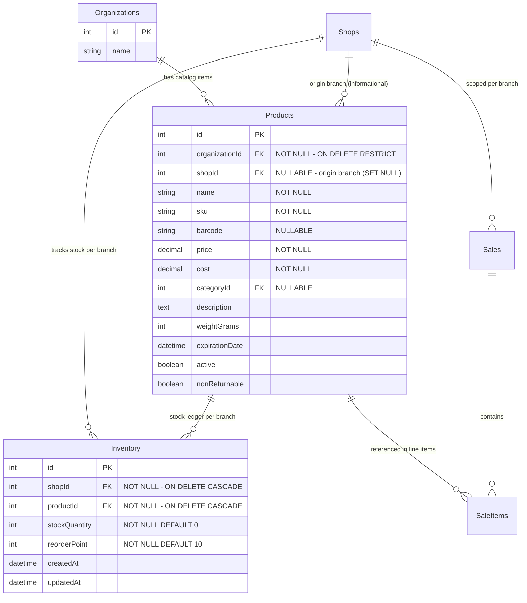
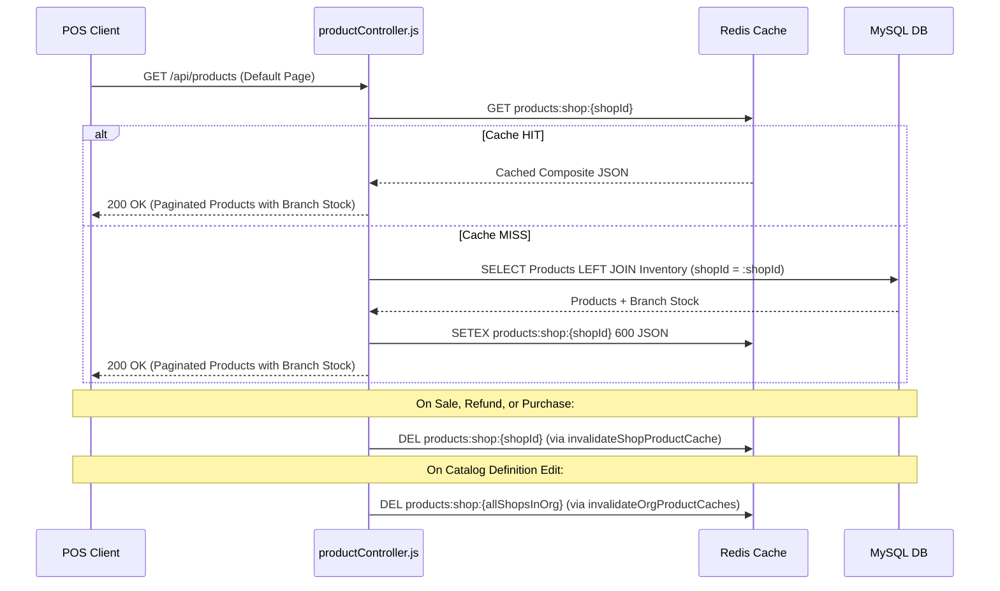

# FINDING-12 Phase 3: Master Catalog & Multi-Shop Inventory Split — Architecture & Implementation Design

## 1. Executive Summary & Architectural Context

### 1.1 The Architectural Problem
In the current Zena POS schema, the `Products` table conflates two distinct operational and economic concepts onto a single database row:
1. **Master Catalog ("What We Sell")**: The definition and commercial identity of an item — `name`, `sku`, `barcode`, `categoryId`, `description`, `price`, `cost`, `weightGrams`, `expirationDate`, `active`, `nonReturnable`.
2. **Branch Inventory ("How Many We Have")**: The physical stock ledger and reordering thresholds for a specific branch — `stockQuantity`, `reorderPoint`.

Because `Products` is currently scoped by `shopId` (with composite unique indexes `unique_products_shop_sku` on `(shopId, sku)` and `unique_products_shop_barcode` on `(shopId, barcode)` introduced in FINDING-04), an enterprise merchant operating multiple physical branch locations under one organization cannot maintain a unified master catalog:
- Each branch is forced to duplicate product definitions, descriptions, barcodes, and SKUs.
- Updating a retail price, description, or barcode requires N separate updates across N shops.
- Point-of-Sale (POS) and purchase operations are siloed per shop, preventing organization-wide stock visibility, centralized catalog management, and future cross-branch inventory transfers.

### 1.2 Target Architecture (Phase 3 of FINDING-12)
Per the approved SaaS transformation roadmap:
```
Platform
└── Organization (Tenant Security Boundary)
    ├── Membership (Org Roles + Branch Access) — [Built in Phase 1]
    ├── Master Catalog (Org-Scoped Product Definitions) — THIS PHASE
    │   ├── Product (Name, SKU, Barcode, Category, Price, Cost, Specs)
    │   └── Inventory (Branch Stock Ledger: shopId + productId, stockQuantity, reorderPoint)
    ├── Customers (Org-Scoped) — [Built in Phase 2]
    ├── Suppliers (Org-Scoped) — [Built in Phase 2]
    ├── AI Analytics (Org Roll-Up) — [Phase 4]
    └── Shop / Branch (1..N Operational Execution)
        ├── Sales & SaleItems (shopId-scoped forever)
        ├── Purchases & PurchaseItems (shopId-scoped forever)
        ├── Invoices & InvoiceItems (shopId-scoped forever)
        └── Expenses (shopId-scoped forever)
```

This design document provides the comprehensive blueprint for splitting `Product` into an **Organization-scoped Master Catalog (`Product`)** and a **Branch-scoped Stock Ledger (`Inventory`)**.

---

## 2. Current State Audit & Codebase Mapping (Part 1)

### 2.1 Current Product Schema & Database Constraints

Querying MySQL directly on the active database (`zana_pos`) confirms the exact structure of `Products`:

#### `Products` Columns:
| Column | Type | Nullable | Key | Default | Notes |
| :--- | :--- | :---: | :---: | :---: | :--- |
| `id` | `INT` | NO | `PRI` | `auto_increment` | Referenced by 6 external operational tables |
| `shopId` | `INT` | NO | `MUL` | NULL | FK to `Shops(id)` (`Products_ibfk_23`) |
| `name` | `VARCHAR(255)` | NO | `MUL` | NULL | Indexed via FULLTEXT `ft_products_name` |
| `description` | `TEXT` | YES | | NULL | Catalog definition |
| `price` | `DECIMAL(10,2)` | NO | | NULL | Base retail price |
| `cost` | `DECIMAL(10,2)` | NO | | NULL | Standard unit cost |
| `categoryId` | `INT` | YES | `MUL` | NULL | FK to `Categories(id)` (`Products_ibfk_24`) |
| `weightGrams` | `INT` | YES | | NULL | Shipping/freight specification |
| `sku` | `VARCHAR(255)` | NO | `MUL` | NULL | Commercial SKU |
| `barcode` | `VARCHAR(255)` | YES | `MUL` | NULL | EAN/UPC barcode |
| `stockQuantity` | `INT` | NO | | `0` | **Branch stock (to be moved to Inventory)** |
| `reorderPoint` | `INT` | NO | | `10` | **Branch threshold (to be moved to Inventory)** |
| `expirationDate` | `DATETIME` | YES | | NULL | Expiration date metadata |
| `active` | `TINYINT(1)` | YES | | `1` | Catalog visibility status |
| `nonReturnable` | `TINYINT(1)` | YES | | `0` | POS return rule |
| `createdAt` | `DATETIME` | NO | | NULL | Timestamp |
| `updatedAt` | `DATETIME` | NO | | NULL | Timestamp |

#### Current Indexes on `Products`:
| Index Name | Indexed Columns | Uniqueness | Purpose |
| :--- | :--- | :---: | :--- |
| `PRIMARY` | `(id)` | UNIQUE | Primary Key |
| `unique_products_shop_sku` | `(shopId, sku)` | UNIQUE | FINDING-04 composite unique index |
| `unique_products_shop_barcode` | `(shopId, barcode)` | UNIQUE | FINDING-04 composite unique index |
| `categoryId` | `(categoryId)` | NON-UNIQUE | FK support index |
| `ft_products_name` | `(name)` | FULLTEXT | Natural language name search |

#### Operational Tables Referencing `Products.id`:
| Referencing Table | Foreign Key Column | Constraint Name | On Delete / Update |
| :--- | :--- | :--- | :--- |
| `SaleItems` | `productId` | `SaleItems_ibfk_30` | `RESTRICT / CASCADE` |
| `PurchaseItems` | `productId` | `PurchaseItems_ibfk_2` | `RESTRICT / CASCADE` |
| `PurchaseOrderItems` | `productId` | `PurchaseOrderItems_ibfk_2` | `RESTRICT / CASCADE` |
| `InvoiceItems` | `productId` | `InvoiceItems_ibfk_20` | `RESTRICT / CASCADE` |
| `SaleRefunds` | `productId` | `SaleRefunds_ibfk_27` | `RESTRICT / CASCADE` |
| `StockMovements` | `productId` | `StockMovements_ibfk_2` | `RESTRICT / CASCADE` |

---

### 2.2 Comprehensive Codebase Audit: Three Usage Buckets

An exhaustive search across the entire codebase revealed **35 distinct files and over 200 code references** to `Product`. We categorize every usage into three functional buckets:

```
                                  Codebase Usages of Product
                                               │
             ┌─────────────────────────────────┼────────────────────────────────┐
             ▼                                 ▼                                ▼
       [Bucket A]                        [Bucket B]                       [Bucket C]
     Catalog-Only                      Inventory-Only                    Both (Join)
  (Definitions & Price)             (Stock Ledger Only)             (POS & Full Admin)
```

#### Bucket A: References Requiring ONLY Catalog Fields
*Fields needed: `id`, `name`, `sku`, `barcode`, `categoryId`, `description`, `price`, `cost`, `nonReturnable`.*
*Destination: Read directly from organization-scoped Master Catalog (`Product`).*

1. **`backend/src/controllers/saleController.js`**:
   - `getAllSales`: Eager-loads `SaleItem.Product` attributes `['id', 'name', 'sku', 'price']`.
   - `getSaleById`: Eager-loads `SaleItem.Product` attributes `['id', 'name', 'sku', 'price']`.
   - `refundSale`: Fetches product definitions to check `nonReturnable` flag and verify sale items.
2. **`backend/src/controllers/customerController.js`**:
   - `getCustomerById`: Aggregates customer favorites (`group: ['SaleItem.productId', 'Product.id', 'Product.name', 'Product.sku', 'Product.price']`).
3. **`backend/src/controllers/employeeController.js`**:
   - `getEmployeeById`: Aggregates employee top-selling products (`group: ['SaleItem.productId', 'Product.id', 'Product.name', 'Product.sku', 'Product.price']`).
4. **`backend/src/controllers/reportsController.js`**:
   - `getSalesSummary`: Aggregates top-selling products (`Product.name`).
   - `getProfitAndLoss`: Calculates Cost of Goods Sold (`COGS = SUM(SaleItem.quantity * COALESCE(Product.cost, 0))`).
5. **`backend/src/controllers/invoiceController.js`**:
   - `getInvoiceById` & `exportInvoicePdf`: Eager-loads `InvoiceItem -> Product` for item descriptions, unit prices, and SKUs on commercial invoice PDFs.
6. **`backend/src/routes/purchases.js` & `backend/src/routes/purchaseOrders.js`**:
   - Item line validation: Validates `item.productId` exists, extracting `matchedProduct.name` and `matchedProduct.sku`.

#### Bucket B: References Requiring ONLY Inventory Fields
*Fields needed: `stockQuantity`, `reorderPoint`, `shopId`, `productId`.*
*Destination: Read/Write against branch-scoped `Inventory` table.*

1. **`backend/src/controllers/productController.js`**:
   - `updateStock` (`PATCH /api/products/:id/stock`): Mutates stock by delta (`delta: quantity`), previously executing `product.update({ stockQuantity: newQuantity })`.
2. **`backend/src/controllers/saleController.js` & `backend/src/services/EnhancedSaleService.js`**:
   - Sale validation: Checks stock sufficiency (`inventory.stockQuantity < item.quantity`).
   - Sale execution: Atomically decrements stock (`inventory.decrement('stockQuantity', { by: item.quantity, transaction: t })`).
   - Sale refund: Restocks returned quantity (`inventory.increment('stockQuantity', { by: item.quantity, transaction: t })`).
3. **`backend/src/services/purchaseService.js`**:
   - `receivePurchaseItems`: Restocks received inventory (`inventory.update({ stockQuantity: newStock })`).
   - `reversePurchaseInventory`: Deducts reversed inventory on purchase cancellation.
4. **`backend/src/models/StockMovement.js`**:
   - Immutable audit trail recording delta, previous stock, and new stock per shop and product.

#### Bucket C: References Requiring BOTH Catalog & Inventory Fields
*Fields needed: Joins catalog definition with branch inventory (`name`, `price`, `sku` + `stockQuantity`, `reorderPoint`).*
*Destination: Joined query (`Product LEFT JOIN Inventory ON Inventory.productId = Product.id AND Inventory.shopId = :shopId`).*

1. **`backend/src/controllers/productController.js`**:
   - `getAllProducts` (`GET /api/products`): Main catalogue endpoint used by POS checkout and admin inventory management. Returns merged product details with branch stock, and filters by `availability` (`in_stock`, `low_stock`, `out_of_stock`).
   - `getProductById` (`GET /api/products/:id`): Retrieves single product details with branch stock count.
   - `getProductsBatch` (`GET /api/products/batch`): Fast cart revalidation fetching `['id', 'name', 'sku', 'price', 'stockQuantity', 'active']`.
   - `createProduct` (`POST /api/products`): Provisions catalog definition and seeds initial branch inventory (`stockQuantity`, `reorderPoint`).
   - `updateProduct` (`PUT /api/products/:id`): Updates catalog attributes and/or branch inventory stock thresholds.
2. **`backend/src/controllers/insightsController.js`**:
   - `getInventoryAlerts`: Compares `Inventory.stockQuantity <= Inventory.reorderPoint`.
   - `getStockDepletionForecast`: Passes `current_stock` and product names to forecasting engine.
   - `getSlowMovingProducts`: Reads stock counts alongside sales history.

---

### 2.3 FINDING-11 Cache Architecture Evaluation (`productCache.js`)

In FINDING-11, Redis caching was established using the key pattern `products:shop:${shopId}` to cache the default page of `/api/products` for sub-millisecond POS checkout performance.

#### Evaluation of Caching Approaches:

| Evaluation Dimension | Option 1: Dual-Cache (`catalog:org:${orgId}` + `inventory:shop:${shopId}`) | Option 2: Composite Shop Cache (`products:shop:${shopId}`) — **RECOMMENDED** |
| :--- | :--- | :--- |
| **Redis Network Roundtrips** | 2 queries per POS request | **1 query (`GET`)** |
| **Node.js Memory Stitching** | High (must zip catalog array with inventory array on every read) | **Zero (pre-joined serialized JSON)** |
| **Availability Filtering** | Impossible in Redis without reading both entire sets | **Trivial (handled at database join before caching)** |
| **Invalidation on Sale** | Invalidates `inventory:shop:${shopId}` | Invalidates `products:shop:${shopId}` via existing helper |
| **Invalidation on Catalog Edit** | Invalidates `catalog:org:${orgId}` | Invalidates all `products:shop:${sId}` for shops in org |
| **Code Churn & Blast Radius** | High (requires redesigning cache client and reader) | **Minimal (reuses hardened FINDING-11 infrastructure)** |

**Recommendation**: **Option 2 (Composite Shop Cache)**.
Keep the Redis key `products:shop:${shopId}`. When a cache miss occurs, the database query executes a fast `LEFT JOIN` between `Product` and `Inventory` for that shop, caching the composite result for 10 minutes (600s).
- All existing stock-mutating triggers (`EnhancedSaleService`, `saleController`, `purchaseService`, `updateStock`) continue to call `invalidateShopProductCache(shopId)`.
- When an administrator modifies catalog definitions (name, price, barcode), the backend triggers a helper `invalidateOrgProductCaches(organizationId)` which invalidates `products:shop:${shopId}` for all shops belonging to that organization.

---

### 2.4 Stock-Mutating Code Path Map

| Operation | Trigger File & Function | Current Mutation | Target Mutation (Phase 3) | Pessimistic Lock |
| :--- | :--- | :--- | :--- | :---: |
| **Sale Checkout** | `EnhancedSaleService.js:createSale` & `saleController.js:createSaleInternal` | `product.decrement('stockQuantity', { by: qty, transaction: t })` | `inventory.decrement('stockQuantity', { by: qty, transaction: t })` | `lock: t.LOCK.UPDATE` on `Inventory` |
| **Sale Item Refund** | `saleController.js:refundSale` | `product.increment('stockQuantity', { by: qty, transaction: t })` | `inventory.increment('stockQuantity', { by: qty, transaction: t })` | `lock: t.LOCK.UPDATE` on `Inventory` |
| **Purchase Receiving** | `purchaseService.js:receivePurchaseItems` | `product.update({ stockQuantity: newStock }, { transaction })` | `inventory.update({ stockQuantity: newStock }, { transaction })` | Managed in transaction |
| **Purchase Cancellation** | `purchaseService.js:reversePurchaseInventory` | `product.update({ stockQuantity: newStock }, { transaction })` | `inventory.update({ stockQuantity: newStock }, { transaction })` | Managed in transaction |
| **Manual Stock Adjustment** | `productController.js:updateStock` | `product.update({ stockQuantity: newQuantity })` | `inventory.update({ stockQuantity: newQuantity })` | Managed in transaction |
| **Initial Stock Creation** | `productController.js:createProduct` | `Product.create({ ...data, stockQuantity, reorderPoint })` | `Product.create(...)` then `Inventory.create({ productId, shopId, stockQuantity, reorderPoint })` | Atomic Transaction |

---

### 2.5 AI Microservice Product / Inventory Data Access Audit

We audited the Python FastAPI microservice (`ai_service/`) and its endpoints in `forecasting.py`, `financial_analysis.py`, and `insights.py`:
- **Database Access Findings**: `ai_service` has **ZERO direct connection to MySQL**. There are no database credentials, no SQLAlchemy models in use, and no raw SQL queries anywhere in the Python service.
- **Data Ingestion Pattern**: The Python service is purely stateless HTTP. It receives stock data via JSON payloads sent by the Node.js backend (`insightsController.js` -> `POST /api/forecasting/stock-depletion` with `products: [{ product_id, product_name, current_stock, daily_sales }]`).
- **Conclusion**: **Phase 3 has ZERO Python-side code impact**. Only the Node.js query feeding the payload needs to pull `current_stock` from `Inventory` instead of `Product`.

---

## 3. Collision & Data Audit Results (Part 2)

A data audit script was executed against the primary database (`zana_pos`).

### 3.1 Organization & Shop Inventory
```
┌─────────┬───────┬─────────────────────────────────────┬────────┬─────────────────────────────────────┐
│ (index) │ orgId │ orgName                             │ shopId │ shopName                            │
├─────────┼───────┼─────────────────────────────────────┼────────┼─────────────────────────────────────┤
│ 0       │ 1     │ 'Shop 1'                            │ 1      │ 'Shop 1'                            │
│ 1       │ 2     │ 'Shop 2'                            │ 2      │ 'Shop 2'                            │
│ 2       │ 3     │ 'Default Shop'                      │ 3      │ 'Default Shop'                      │
│ 3       │ 4     │ 'Soko Safi Supermarket (Westlands)' │ 4      │ 'Soko Safi Supermarket (Westlands)' │
│ 4       │ 5     │ 'Main POS'                          │ 5      │ 'Main POS'                          │
│ 5       │ 6     │ 'Realmer technology limited'        │ 17     │ 'Realmer technology limited'        │
└─────────┴───────┴─────────────────────────────────────┴────────┴─────────────────────────────────────┘
```

### 3.2 Product Counts & Distribution
```
┌─────────┬────────────────┬─────────────────────────────────────┬────────┬───────────────┬──────────────┬──────────────────┬───────────────┬────────────┐
│ (index) │ organizationId │ orgName                             │ shopId │ totalProducts │ distinctSkus │ distinctBarcodes │ emptyBarcodes │ totalStock │
├─────────┼────────────────┼─────────────────────────────────────┼────────┼───────────────┼──────────────┼──────────────────┼───────────────┼────────────┤
│ 0       │ 1              │ 'Shop 1'                            │ 1      │ 63            │ 63           │ 25               │ '38'          │ '3295'     │
│ 1       │ 4              │ 'Soko Safi Supermarket (Westlands)' │ 4      │ 15            │ 15           │ 15               │ '0'           │ '539'      │
└─────────┴────────────────┴─────────────────────────────────────┴────────┴───────────────┴──────────────┴──────────────────┴───────────────┴────────────┘
```

### 3.3 SKU & Barcode Collision Analysis
- **Intra-Organization SKU Collisions**: **0** (no organization currently contains multiple shops sharing a SKU).
- **Cross-Organization SKU Collisions**: **0** (all 78 products across all shops have globally distinct SKUs).
- **Intra-Organization Barcode Collisions**: **0** (no duplicate barcodes within any organization).
- **Cross-Organization Barcode Collisions**: **0** (all non-empty barcodes are distinct across shops).
- **Null / Empty Barcodes**: Shop 1 has 38 products with null/empty barcodes. In MySQL, unique indexes permit multiple `NULL` values, ensuring `unique_products_org_barcode` will not collide on null barcodes.

### 3.4 Data Audit Verdict
1. In the active primary database, **100% of existing products fall into Case (a): zero SKU overlap (1:1 mapping)**.
2. There are currently **zero multi-shop organizations with products** in `zana_pos`.
3. However, to guarantee absolute robustness for test environments and future multi-shop operations, the migration must formally specify deterministic handling for all three cases:
   - **Case (a)**: 1:1 mapping (zero SKU overlap).
   - **Case (b)**: Intra-org SKU overlap with identical non-stock fields.
   - **Case (c)**: Intra-org SKU overlap with differing non-stock fields (price, cost, name, category divergences).

---

## 4. Target Architecture & Design Proposal (Part 3)

### 4.1 Entity Modeling & Naming Decision

#### The Core Dilemma
Should we rename `Product` to `CatalogItem` and introduce `Inventory`? Or should we keep the model named `Product` for the catalog entity and introduce `Inventory` for the branch stock ledger?

```
Option A: Full Rename                           Option B: Repurpose Product (RECOMMENDED)
---------------------                           -----------------------------------------
CatalogItem (Org-scoped definition)             Product (Org-scoped definition)
Inventory   (Branch-scoped stock)               Inventory (Branch-scoped stock)

Blast Radius:                                   Blast Radius:
- Over 35 files touched                         - 8 files touched
- 6 foreign keys rewritten                      - 0 foreign keys rewritten
- Every historic join rewritten                 - All historic joins preserved
- High regression risk                          - Surgical, production-grade change
```

#### Justification for Option B: Repurposing `Product` as Catalog Definition
1. **Preservation of Foreign Key Graph**: Tables `SaleItems`, `PurchaseItems`, `PurchaseOrderItems`, `InvoiceItems`, and `SaleRefunds` all have `productId -> Products.id`. Repurposing `Product` means **zero DDL alteration on historic transactional tables**.
2. **Preservation of Eager-Load Semantics**: All reports, receipts, PDFs, and customer profile calculations that do `include: [{ model: Product, attributes: ['name', 'sku', 'price'] }]` continue to function with zero line changes.
3. **Adherence to Operating Rules**: Per Rule 9 ("Implement the smallest complete production-quality solution") and Rule 7 ("Reuse existing architecture and patterns"), Option B minimizes blast radius by an order of magnitude while achieving 100% of the target architectural goals.

---

### 4.2 Target Database Schema



#### Table 1: `Products` (Repurposed as Organization-Scoped Catalog)
```sql
ALTER TABLE Products 
  ADD COLUMN organizationId INT AFTER id,
  MODIFY COLUMN shopId INT NULL,
  DROP COLUMN stockQuantity,
  DROP COLUMN reorderPoint;

ALTER TABLE Products
  ADD CONSTRAINT fk_products_organization_id 
    FOREIGN KEY (organizationId) REFERENCES Organizations(id) 
    ON DELETE RESTRICT ON UPDATE CASCADE,
  ADD CONSTRAINT fk_products_shop_id 
    FOREIGN KEY (shopId) REFERENCES Shops(id) 
    ON DELETE SET NULL ON UPDATE CASCADE;

-- Unique constraints
ALTER TABLE Products DROP INDEX unique_products_shop_sku;
ALTER TABLE Products DROP INDEX unique_products_shop_barcode;
ALTER TABLE Products ADD UNIQUE INDEX unique_products_org_sku (organizationId, sku);
ALTER TABLE Products ADD UNIQUE INDEX unique_products_org_barcode (organizationId, barcode);
ALTER TABLE Products ADD INDEX idx_products_org_createdAt (organizationId, createdAt);
```

#### Table 2: `Inventory` (New Table: Branch Stock Ledger)
```sql
CREATE TABLE Inventory (
  id INT AUTO_INCREMENT PRIMARY KEY,
  shopId INT NOT NULL,
  productId INT NOT NULL,
  stockQuantity INT NOT NULL DEFAULT 0,
  reorderPoint INT NOT NULL DEFAULT 10,
  createdAt DATETIME NOT NULL DEFAULT CURRENT_TIMESTAMP,
  updatedAt DATETIME NOT NULL DEFAULT CURRENT_TIMESTAMP ON UPDATE CURRENT_TIMESTAMP,
  CONSTRAINT fk_inventory_shop_id 
    FOREIGN KEY (shopId) REFERENCES Shops(id) 
    ON DELETE CASCADE ON UPDATE CASCADE,
  CONSTRAINT fk_inventory_product_id 
    FOREIGN KEY (productId) REFERENCES Products(id) 
    ON DELETE CASCADE ON UPDATE CASCADE,
  UNIQUE INDEX unique_inventory_shop_product (shopId, productId),
  INDEX idx_inventory_shop_stock (shopId, stockQuantity)
) ENGINE=InnoDB DEFAULT CHARSET=utf8mb4 COLLATE=utf8mb4_unicode_ci;
```

---

### 4.3 Migration Approach for Existing Data

The migration will be implemented as a sequential, set-based script using `sequelize-cli migration:generate`:

#### Step 1: Add Nullable `organizationId` to `Products`
```sql
ALTER TABLE Products ADD COLUMN organizationId INT NULL AFTER id;
```

#### Step 2: Atomic Set-Based Backfill of `organizationId`
```sql
UPDATE Products p 
JOIN Shops s ON s.id = p.shopId 
SET p.organizationId = s.organizationId 
WHERE p.organizationId IS NULL;
```

#### Step 3: Create `Inventory` Table
Create table `Inventory` with foreign keys and unique index `unique_inventory_shop_product (shopId, productId)`.

#### Step 4: Handle SKU Merges (Cases A, B, and C)

##### Case (a): Zero Intra-Org SKU Overlap (100% of Current Production Data)
Populate `Inventory` directly from `Products`:
```sql
INSERT INTO Inventory (shopId, productId, stockQuantity, reorderPoint, createdAt, updatedAt)
SELECT p.shopId, p.id, p.stockQuantity, p.reorderPoint, NOW(), NOW()
FROM Products p;
```

##### Case (b): Intra-Org SKU Overlap with Identical Non-Stock Fields
If two branches in the same organization created the same SKU with identical commercial fields:
1. Identify the lowest `Product.id` as canonical (`minId`).
2. Insert an `Inventory` row for the secondary branch pointing to `minId` with the secondary branch's `stockQuantity` and `reorderPoint`.
3. Re-point all child transactional tables (`SaleItems`, `PurchaseItems`, `PurchaseOrderItems`, `InvoiceItems`, `SaleRefunds`, `StockMovements`) from the duplicate `productId` to `minId`.
4. Delete the redundant secondary `Product` row.

##### Case (c): Intra-Org SKU Overlap with Differing Non-Stock Fields (Pricing/Cost Divergence)
> [!IMPORTANT]
> **Policy on Commercial Field Divergences**:
> If Shop A sells `COKE-500ML` for KES 100 and Shop B sells `COKE-500ML` for KES 120 under the same organization, an automated migration MUST NOT arbitrarily pick one price and discard the other. Doing so would cause silent pricing drift or margin degradation at one of the branches.
>
> **Recommended Migration Handling for Case (c)**:
> 1. The migration runs an automated pre-check query identifying any intra-org SKU duplicates where `price`, `cost`, or `name` differ.
> 2. If any are detected, the migration preserves both rows by appending a branch disambiguation suffix to the duplicate SKU: e.g., `COKE-500ML-BRANCH-2` and logging a prominent `[MIGRATION WARNING]` with the affected IDs.
> 3. Creates `Inventory` rows for each disambiguated product.
> 4. Merchant administrators can then use the catalog management UI to reconcile the definitions deliberately.

#### Step 5: Enforce Constraints & Drop Legacy Columns
1. Enforce `Products.organizationId` `NOT NULL`.
2. Make `Products.shopId` nullable with `ON DELETE SET NULL`.
3. Drop `unique_products_shop_sku` and `unique_products_shop_barcode`.
4. Create `unique_products_org_sku` on `(organizationId, sku)` and `unique_products_org_barcode` on `(organizationId, barcode)`.
5. Drop `stockQuantity` and `reorderPoint` from `Products`.

#### Step 6: Fully Reversible `down` Migration
Reconstructs `Products.stockQuantity` and `Products.reorderPoint` by joining with `Inventory`, drops `Inventory`, and restores shop-scoped unique indexes.

---

### 4.4 Category Cross-Branch Scoping Note (Critical Finding)

During our audit of `productController.js`, we identified a critical interaction with `Categories`:
```javascript
// Current code in productController.js:59
include: [
  { model: Category, attributes: ['id', 'name'], where: { shopId: req.user.shopId } }
]
```
`Categories` is currently scoped to `shopId`. If Product becomes organization-scoped:
- When Shop 1 creates a product under Category 44 (which has `shopId: 1`), and a user at Shop 2 (same organization) queries `/api/products`, the inner join `where: { shopId: 2 }` would **filter out the product entirely**!
- **Resolution**:
  In `productController.js`, the Category include must be changed to:
  ```javascript
  include: [
    { 
      model: Category, 
      attributes: ['id', 'name'], 
      required: false // LEFT JOIN, allowing shared products to render even if category was created at another branch
    }
  ]
  ```
  *(Full Category organization-scoping can be addressed in a subsequent cleanup, but `required: false` completely eliminates this regression risk in Phase 3)*.

---

### 4.5 Cache Redesign: Composite Shop Cache



1. **Cache Key Pattern**: `products:shop:${shopId}` (unchanged from FINDING-11).
2. **Cache Value Structure**: Serialized JSON array of composite objects:
   ```json
   {
     "count": 78,
     "rows": [
       {
         "id": 1,
         "organizationId": 1,
         "name": "Fresh Milk 500ml",
         "sku": "MILK-500",
         "barcode": "616110123456",
         "price": 60.00,
         "cost": 45.00,
         "categoryId": 46,
         "active": true,
         "stockQuantity": 24,
         "reorderPoint": 10
       }
     ]
   }
   ```
3. **Invalidation Functions** in `backend/src/services/productCache.js`:
   - `invalidateShopProductCache(shopId)`: Invalidates cache for single shop upon stock change (sales, refunds, stock adjustments).
   - `invalidateOrgProductCaches(organizationId)`: Queries all shops in the organization and invalidates their product caches when catalog definitions are modified.

---

### 4.6 Stock-Mutation Transaction Flow (Pessimistic Locking)

To prevent race conditions during concurrent checkouts across registers, stock mutations will operate directly on `Inventory` using InnoDB row-level locking:

```javascript
// Example: EnhancedSaleService / saleController checkout flow
await sequelize.transaction(async (t) => {
  for (const item of items) {
    // 1. Verify Catalog item is valid and active in caller's organization
    const product = await Product.findOne({
      where: { id: item.productId, active: true, organizationId },
      transaction: t
    });
    if (!product) throw new Error(`Product ${item.productId} not found`);

    // 2. Pessimistically lock branch Inventory record
    const inventory = await Inventory.findOne({
      where: { productId: product.id, shopId },
      lock: t.LOCK.UPDATE,
      transaction: t
    });

    if (!inventory || inventory.stockQuantity < item.quantity) {
      const err = new Error(`Insufficient stock for product: ${product.name}`);
      err.statusCode = 409;
      throw err;
    }

    // 3. Atomically decrement stock
    await inventory.decrement('stockQuantity', { by: item.quantity, transaction: t });

    // 4. Record immutable StockMovement
    await StockMovement.create({
      shopId,
      productId: product.id,
      quantity: -item.quantity,
      previousStock: inventory.stockQuantity,
      newStock: inventory.stockQuantity - item.quantity,
      type: 'SALE',
      reference: sale.invoiceNumber,
      userId: user.id
    }, { transaction: t });
  }
});
```

---

### 4.7 API & Controller Impact Matrix

| File | Function / Endpoint | Current Behavior | Phase 3 Target Behavior |
| :--- | :--- | :--- | :--- |
| `productController.js` | `getAllProducts`<br>`GET /api/products` | Queries `Product` with `shopId: req.user.shopId` and filters on `Product.stockQuantity`. | Queries `Product` with `organizationId: req.organizationId`. `LEFT JOIN Inventory ON Inventory.productId = Product.id AND Inventory.shopId = req.shopId`. Filters availability on `Inventory.stockQuantity`. Flattens `stockQuantity` onto response object. |
| `productController.js` | `getProductById`<br>`GET /api/products/:id` | Queries `Product` with `id` and `shopId`. | Queries `Product` with `id` and `organizationId`. Joins `Inventory` for `req.shopId`. |
| `productController.js` | `createProduct`<br>`POST /api/products` | Creates single row in `Products` with `stockQuantity`. | In a transaction: creates `Product` (`organizationId`, `shopId` as origin), then creates `Inventory` (`shopId: req.shopId`, `productId`, `stockQuantity`, `reorderPoint`). |
| `productController.js` | `updateProduct`<br>`PUT /api/products/:id` | Updates `Products` row directly. | Updates `Product` catalog fields (`where: { id, organizationId }`). If `stockQuantity` or `reorderPoint` supplied, upserts `Inventory` row for `req.shopId`. Calls `invalidateOrgProductCaches(req.organizationId)`. |
| `productController.js` | `updateStock`<br>`PATCH /api/products/:id/stock` | Updates `Product.stockQuantity`. | Finds `Inventory` row for `(productId, shopId)`. Updates `Inventory.stockQuantity`. Calls `invalidateShopProductCache(req.shopId)`. |
| `productController.js` | `getProductsBatch`<br>`GET /api/products/batch` | Fetches `Products` with `shopId`. | Fetches `Products` with `organizationId`, joins `Inventory` for `shopId`. |
| `saleController.js` | `createSaleInternal`<br>`POST /api/sales` | Locks `Product` and decrements `Product.stockQuantity`. | Verifies `Product` in `organizationId`. Locks `Inventory` for `(productId, shopId)` and decrements `Inventory.stockQuantity`. |
| `saleController.js` | `refundSale`<br>`POST /api/sales/:id/refund` | Increments `Product.stockQuantity`. | Increments `Inventory.stockQuantity` for `(productId, shopId)`. |
| `EnhancedSaleService.js` | `createSale` | Locks `Product` and decrements `Product.stockQuantity`. | Locks `Inventory` for `(productId, shopId)` and decrements `Inventory.stockQuantity`. |
| `purchaseService.js` | `receivePurchaseItems` | Increments `Product.stockQuantity`. | Upserts `Inventory` for `(productId, shopId)` and increments stock. Creates `StockMovement`. |
| `purchaseService.js` | `reversePurchaseInventory` | Decrements `Product.stockQuantity`. | Decrements `Inventory.stockQuantity` for `(productId, shopId)`. Creates `StockMovement`. |
| `insightsController.js` | Stock depletion & alerts | Reads `Product.stockQuantity`. | Joins `Inventory` for `shopId` and reads `Inventory.stockQuantity`. |

---

### 4.8 Staging Recommendation: Splitting Phase 3 into Sub-Phases

Given that `Product` is referenced across more than 35 files, implementing the schema migration, full controller rewrite, checkout lock refactor, and cache invalidation in a single pass presents an unnecessarily high blast radius.

We strongly recommend decomposing Phase 3 into **three sequential, individually verifiable sub-phases**:

```
                       Phase 3 Implementation Roadmap
                                     │
           ┌─────────────────────────┼─────────────────────────┐
           ▼                         ▼                         ▼
      [Phase 3A]                [Phase 3B]                [Phase 3C]
 Schema & Inventory        Stock Mutation Engine     Catalog Administration
  Dual-Write Bridge         (Sales, Purchases,        & Cache Hardening
(Zero Downtime DDL)          Refunds, Locks)          (Multi-Shop Sync)
```

#### Sub-Phase 3A: Schema Migration & Read Paths (Zero-Downtime Foundation)
- Generate and execute migration: Create `Inventory` table, backfill from `Products`, add `organizationId` to `Products`, restructure unique indexes to `(organizationId, sku)` and `(organizationId, barcode)`.
- Introduce `Inventory.js` model and associations in `models/index.js`.
- Temporarily retain `Products.stockQuantity` and `Products.reorderPoint` as columns.
- Update read paths (`getAllProducts`, `getProductById`, `getProductsBatch`) to join `Inventory` for branch stock.
- **Verification**: Test database migration, read queries return identical data, full Jest suite passes.

#### Sub-Phase 3B: Stock Mutation Workflows & Pessimistic Ledger
- Refactor all write paths:
  - `saleController.js` & `EnhancedSaleService.js` checkout (pessimistic lock on `Inventory`).
  - `saleController.js:refundSale` (increment `Inventory`).
  - `purchaseService.js` receipt & reversal (update `Inventory`).
  - `productController.js:updateStock` (update `Inventory`).
- Keep dual-write to `Products.stockQuantity` during 3B to ensure zero regression for any un-migrated query.
- **Verification**: Concurrent checkout stress test, purchase receiving test, refund test, Jest suite.

#### Sub-Phase 3C: Column Retirement & Cache Invalidation Hardening
- Drop deprecated `Products.stockQuantity` and `Products.reorderPoint` columns via cleanup migration.
- Implement `invalidateOrgProductCaches(organizationId)` in `productCache.js`.
- Update `insightsController.js` stock depletion queries.
- **Verification**: Full 16-suite Jest pass, cross-branch stock isolation test, cache invalidation verification.

---

## 5. Explicit Non-Scope (Part 4)

To prevent scope creep, the following boundaries are strictly enforced:
1. **No Scope Changes to Operational Transactions**:
   - `Sales`, `SaleItems`, `Purchases`, `PurchaseItems`, `PurchaseOrders`, `PurchaseOrderItems`, `Invoices`, `InvoiceItems`, and `Expenses` **remain strictly `shopId`-scoped forever**.
   - Only the target entity they point to changes internal organization (a `SaleItem` still has `productId`, but `Product` is now catalog-level and stock is verified in `Inventory`).
2. **No Frontend UI Modifications**:
   - The JSON shape returned by `/api/products`, `/api/sales`, and `/api/purchases` remains 100% backward-compatible. Frontend POS and inventory screens require zero changes.
3. **No Phase 4+ Features**:
   - No AI organization-level rollups (Phase 4).
   - No physical Registers / Cash Drawers (Phase 5).
   - No Billing / Subscriptions / Plan Limits (Phase 6).

---

## 6. Risk Analysis & Interactions (Part 5)

| Risk Factor | Affected Component | Severity | Mitigation Strategy |
| :--- | :--- | :---: | :--- |
| **Index Collision during Migration** | `Products` unique constraints | HIGH | Use the dynamic idempotent index drop/create pattern from FINDING-04. Drop `unique_products_shop_sku` and `unique_products_shop_barcode` before creating `unique_products_org_sku` and `unique_products_org_barcode`. |
| **Race Condition during Checkout** | POS concurrent checkouts | HIGH | Pessimistically lock `Inventory` rows (`lock: t.LOCK.UPDATE`) inside the database transaction before decrementing. |
| **Stale POS Cache** | Redis `products:shop:${shopId}` | HIGH | Preserve FINDING-11's `invalidateShopProductCache(shopId)` on all stock mutators, and introduce `invalidateOrgProductCaches(organizationId)` on catalog edits. |
| **Category Cross-Branch Join Failure** | `productController.js:59` | MEDIUM | Change Category include in `getAllProducts` to `required: false` (LEFT JOIN) so shared products render across all branches even before categories are org-scoped. |
| **Foreign Key Locking** | MySQL InnoDB | MEDIUM | Add supporting index `idx_products_shop_id` before modifying `shopId` foreign key. |
| **Phase 1 / Phase 2 Interoperability** | Auth & Scoping Middleware | LOW | Reuses `req.organizationId` and `req.shopId` extracted cleanly by Phase 1's `auth` middleware. Zero changes to Phase 1 or Phase 2 migrations. |

---

## 7. Next Steps & Approval Gate

This design document completes the audit and technical specification for FINDING-12 Phase 3. 

### Key Audit Findings Summary for User Sign-Off:
1. **Active Primary DB State**: Currently, all 78 products in `zana_pos` have globally distinct SKUs and barcodes across both active shops (Shop 1: 63 products, Shop 4: 15 products). There are currently **0 intra-org SKU collisions** and **0 field divergence cases (Case A 100%)**.
2. **Entity Naming**: Confirmed decision to keep `Product` as the organization-scoped catalog definition and introduce `Inventory` as the branch stock ledger.
3. **Staging Recommendation**: Recommended splitting Phase 3 into Sub-Phases 3A (Schema + Reads), 3B (Write Paths + Locks), and 3C (Column Cleanup + Cache).

**HARD STOP**: Awaiting user review and explicit approval of this design document before generating any migrations or writing implementation code.
