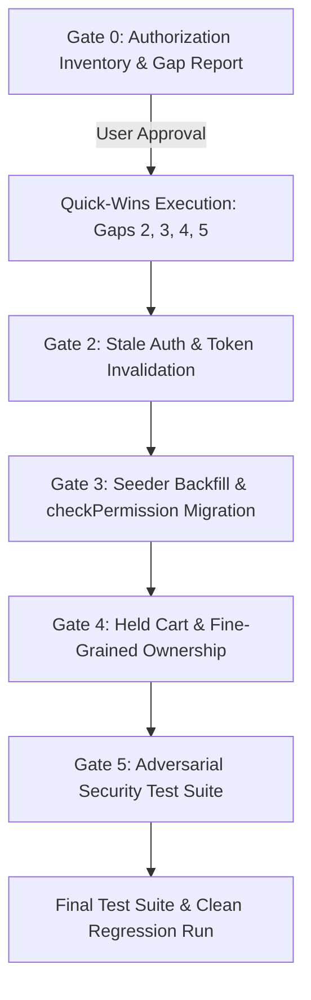

# Zana POS — Authorization Matrix & Gap Report

## 1. Executive Summary & Document Metadata

- **Repository**: `https://github.com/Warrenchris/zena-pos`
- **Target Branch**: `master`
- **Source-of-Truth Baseline**: Commit `1f45448` (October 2, 2026)
- **Phase**: **Phase 0 — Authorization Inventory & Gap Report**
- **Document Path**: `docs/security/AUTHORIZATION-MATRIX.md`
- **Status**: **Draft / Awaiting Gate 0 Review & Approval**

### 1.1 Objective & Context
This audit establishes an exhaustive, route-by-route authorization inventory and implementation gap report for the Zana POS platform. Zana POS is a production-oriented, multi-tenant SaaS for African SMEs featuring multi-branch POS, inventory management, CRM, ERP, and localized payments (M-Pesa STK push, card gateways).

The primary objective of this phase is to evaluate all exposed endpoints, analyze existing access control mechanisms, identify fragmented or missing authorization paths, and formulate a consolidated, backward-compatible enforcement architecture.

### 1.2 Core Target Authorization Pipeline
The system is transitioning from fragmented, ad-hoc `checkRole()` checks to a unified, multi-tier authorization hierarchy:

```text
Identity (Authentication: Bearer JWT)
   ↓
Authenticated Session (Revocation / Cutoff / Active Account Check)
   ↓
Organization Membership (Multi-Tenant Isolation & Active orgRole)
   ↓
Shop / Branch Access (Explicit ShopAccess Assignment or Owner/Admin Scope)
   ↓
Permission Bundle (Database-backed RolePermission via Scoped Cache)
   ↓
Resource Scope & Ownership (Tenant/Shop Isolation & Cashier/User Filtering)
   ↓
ALLOW / DENY
```

### 1.3 Preserved SaaS Invariants
In accordance with Rule 2 of the master engineering specification, this consolidation strictly preserves:
1. **Multi-Tenant Identity Architecture**: `Organization`, `OrganizationMembership` (`orgRole`), `Shop`, `ShopAccess`, `User`, `Employee`.
2. **Platform vs. Tenant Boundary**: Platform `super_admin` operations (`requirePlatformSuperAdmin`) operate in an isolated context (`req.shopId = null; req.organizationId = null;`) and remain strictly separated from tenant organizational spaces.
3. **Admin Equivalence to Owner**: Legacy `User.role === 'admin'` represents organization ownership/creator privileges. The mapping `admin -> all permissions` is an intentional architectural pattern, not a security vulnerability.
4. **Subscription Hard Gates**: `requireActiveSubscription` blocks write mutations across branches when a tenant is suspended or past-due.
5. **Cryptographic Payment Security**: M-Pesa STK push and Flutterwave webhooks use single-use cryptographic tokens and timing-safe HMAC validation.
6. **Anti-Oracle Enumeration**: Cross-tenant and cross-branch IDOR attempts consistently return `404 Not Found` (identical to non-existent resources) to prevent tenant enumeration.

---

## 2. Quantitative Pattern Analysis

A full static analysis across all 37 route files in `backend/src/routes/` and core middleware yields the following baseline metrics:

| Metric | Count | Architectural Implication |
|---|:---:|---|
| **Total Route Files** | **37** | 35 mounted (34 in `app.js` + 1 sub-router), 2 dead/unmounted. |
| **Total Active Endpoints** | **173** | All mounted API routes audited in Section 4. |
| **`checkRole(...)` Usages** | **71** | Primary authorization mechanism; trusts decoded JWT role without reloading state. |
| **`checkPermission(...)` Usages** | **5** | Severely under-utilized (`sales.js` [3], `settings.js` [1], `splitSales.js` [1]). |
| **`requireOrgAdmin` Usages** | **11** | Enforces delegated or owner organization-level administrative boundary. |
| **`requireOrgOwner` Usages** | **9** | Enforces absolute organization ownership (`orgRole === 'owner'`). |
| **`requirePlatformSuperAdmin` Usages** | **6** | Secures `/api/platform/*` SaaS operator endpoints. |
| **Direct `req.user.role` Access** | **21** | Controller-level branch checks; tightly couples controllers to legacy schema. |
| **Direct `req.user.orgRole` Access** | **7** | Controller-level organizational role checks. |
| **`revokeAllUserTokens` Calls** | **5** | Only triggered on password reset, password change, and account closure. |

### Classification Taxonomy
Every endpoint in this inventory is classified under one of the following canonical designations:
- **`AUTH_ONLY`**: Requires a valid JWT, but performs no role, permission, or resource-ownership evaluation.
- **`ROLE_BASED`**: Checks static user role against an allowed list using `checkRole(['admin', ...])`.
- **`PERMISSION_BASED`**: Verifies dynamic, database-backed granular permissions using `checkPermission(name)`.
- **`RESOURCE_SCOPED`**: Constrains data access via `organizationId`, `shopId`, or `userId` query filters at the ORM layer.
- **`OWNER_ONLY`**: Restricts access exclusively to tenant organization owners (`requireOrgOwner`).
- **`PLATFORM_ONLY`**: Restricts access exclusively to SaaS platform operators (`requirePlatformSuperAdmin`).
- **`MIXED`**: Combines multiple enforcement layers (e.g., `checkRole` + `RESOURCE_SCOPED`).
- **`PUBLIC`**: Unauthenticated endpoint (e.g., public auth endpoints, status probes, external webhooks).

---

## 3. Dead & Unmounted Route Audit

During repository inspection, two route files were identified as completely unmounted and dead code:

### 3.1 `backend/src/routes/dashboardRoutes.js`
- **Mount Status**: **DEAD / UNMOUNTED**.
- **Evidence**: `backend/src/app.js` line 47 imports `const dashboardRoutes = require('./routes/dashboard');` and mounts it at line 201: `app.use('/api/dashboard', dashboardRoutes);`.
- **Contents**: Defines 7 endpoints: `/stats`, `/revenue`, `/top-products`, `/visitors`, `/orders`, `/platform`, `/locations`.
- **Risk**: Maintenance hazard. Changes made to `dashboardRoutes.js` will have zero runtime effect, misleading developers and security reviewers.
- **Recommendation**: Archive or remove during cleanup phase.

### 3.2 `backend/src/routes/categoryRoutes.js`
- **Mount Status**: **DEAD / UNMOUNTED**.
- **Evidence**: `backend/src/app.js` line 36 imports `const categoryRoutes = require('./routes/categories');` and mounts it at line 183: `app.use('/api/categories', categoryRoutes);`.
- **Contents**: Defines 5 endpoints: `/`, `/:id/subcategories`, `/:id`, `POST /`, `PUT /:id`, `DELETE /:id`.
- **Risk**: Divergent middleware. `categoryRoutes.js` imports `checkRole` from `../middleware/rolePermissions` whereas `categories.js` imports `checkRole` from `../middleware/auth`.
- **Recommendation**: Archive or remove during cleanup phase.

---

## 4. Comprehensive Route-by-Route Authorization Inventory

The following table documents every active endpoint in Zana POS, its current middleware pipeline, current classification, verified enforcement rule, consolidated target enforcement, and relevant security flags.

> [!NOTE]
> Endpoints tagged with **`[QUICK-WIN]`** represent high-severity authorization gaps that can be closed immediately via a single middleware addition without schema migrations.

### 4.1 Authentication (`/api/auth`)
*Source: `backend/src/routes/auth.js`*

| Method | Endpoint | Pipeline | Classification | Current Enforcement | Target Enforcement | Flags / Notes |
|---|---|---|---|---|---|---|
| `POST` | `/api/auth/register` | `registerLimiter`, `validate` | `PUBLIC` | Open registration | Open registration (Rate-limited) | Public |
| `POST` | `/api/auth/login` | `authLimiter`, `validate` | `PUBLIC` | Email/password credential verification | Email/password credential verification | Public |
| `POST` | `/api/auth/forgot-password` | `authLimiter`, `validate` | `PUBLIC` | Email lookup & reset token generation | Email lookup & reset token generation | Public |
| `POST` | `/api/auth/reset-password` | `authLimiter`, `validate` | `PUBLIC` | Reset token validation + `revokeAllUserTokens` | Reset token validation + `revokeAllUserTokens` | Invalidates tokens |
| `POST` | `/api/auth/verify-email` | `verifyEmailLimiter`, `validate` | `PUBLIC` | Crypto token verification | Crypto token verification | Public |
| `POST` | `/api/auth/resend-verification` | `auth`, `resendLimiter` | `AUTH_ONLY` | Valid session | Valid session | `resendLimiter` |
| `GET` | `/api/auth/profile` | `auth` | `AUTH_ONLY` | Authenticated user profile retrieval | Authenticated user profile retrieval | Self only |
| `POST` | `/api/auth/change-password` | `auth` | `AUTH_ONLY` | Password verification + `revokeAllUserTokens` | Password verification + `revokeAllUserTokens` | Invalidates tokens |
| `POST` | `/api/auth/logout` | `auth` | `AUTH_ONLY` | Blacklists current token JTI | Blacklists current token JTI | Single token |
| `POST` | `/api/auth/switch-shop` | `auth`, `validate` | `MIXED` | Checks `ShopAccess` or owner in controller | `shopAuth` + `ShopAccess` verification | Branch switch |

---

### 4.2 Users & Staff Administration (`/api/users`)
*Source: `backend/src/routes/users.js`*

| Method | Endpoint | Pipeline | Classification | Current Enforcement | Target Enforcement | Flags / Notes |
|---|---|---|---|---|---|---|
| `GET` | `/api/users` | `auth`, `checkRole(['admin'])` | `ROLE_BASED` | Legacy `req.user.role === 'admin'` | `checkPermission('manage_users')` | Finding F |
| `POST` | `/api/users` | `auth`, `checkRole(['admin'])`, `requireVerifiedEmail` | `MIXED` | Admin role + owner check for admin creation | `checkPermission('manage_users')` + owner gate | Finding F |
| `PUT` | `/api/users/:id/role` | `auth`, `checkRole(['admin'])` | `MIXED` | Admin role + owner check for modifying owner | `checkPermission('manage_users')` + **REVOKE TOKENS** | **FINDING A/B (Stale Auth)** |

---

### 4.3 Employees (`/api/employees`)
*Source: `backend/src/routes/employees.js`*

| Method | Endpoint | Pipeline | Classification | Current Enforcement | Target Enforcement | Flags / Notes |
|---|---|---|---|---|---|---|
| `GET` | `/api/employees` | `auth`, `checkRole(['admin', 'manager', 'org_admin', 'cashier'])` | `ROLE_BASED` | Any valid role, scoped to shop | `checkPermission('view_employees')` | Tenant/Shop scoped |
| `GET` | `/api/employees/:id` | `auth`, `checkAdminOrSelf` | `MIXED` | Admin, org_admin, or self ID match | `checkPermission('view_employees')` or Self | Self or Admin |
| `POST` | `/api/employees` | `auth`, `checkRole(['admin', 'org_admin'])`, `requireVerifiedEmail` | `ROLE_BASED` | Admin/org_admin; creates user+employee | `checkPermission('manage_employees')` | Staff creation |
| `PUT` | `/api/employees/:id` | `auth`, `checkRole(['admin', 'org_admin'])`, `ensureShopIsolation` | `MIXED` | Admin/org_admin; promotes position | `checkPermission('manage_employees')` + **REVOKE TOKENS** | **FINDING A/B (Stale Auth)** |
| `DELETE` | `/api/employees/:id` | `auth`, `checkRole(['admin', 'org_admin'])` | `ROLE_BASED` | Admin/org_admin; soft deletes employee | `checkPermission('manage_employees')` + Revoke | Demotion/Removal |

---

### 4.4 Shops & Branch Delegation (`/api/shop` & `/api/shops`)
*Source: `backend/src/routes/shop.js`*

| Method | Endpoint | Pipeline | Classification | Current Enforcement | Target Enforcement | Flags / Notes |
|---|---|---|---|---|---|---|
| `GET` | `/api/shop/accessible` | `auth` | `AUTH_ONLY` | Resolves branches accessible to caller | Resolves branches accessible to caller | Self scoped |
| `POST` | `/api/shop` | `auth`, `requireActiveSubscription`, `validate` | `MIXED` | Controller checks `role==='admin'` or `orgRole==='owner'` | `requireOrgOwner` or `checkPermission('manage_settings')` | Branch creation |
| `GET` | `/api/shop/me` | `auth` | `AUTH_ONLY` | Returns shop from caller's `req.shopId` | Returns shop from caller's `req.shopId` | Self scoped |
| `PUT` | `/api/shop/me` | `auth`, `checkRole(['admin', 'manager', 'org_admin'])` | `ROLE_BASED` | Admin, manager, org_admin | `checkPermission('manage_settings')` | Shop profile |
| `PATCH` | `/api/shop/:id/deactivate` | `auth`, `requireActiveSubscription` | `MIXED` | Controller checks `orgRole === 'owner'` | `requireOrgOwner` | Reversible lifecycle |
| `PATCH` | `/api/shop/:id/activate` | `auth`, `requireActiveSubscription` | `MIXED` | Controller checks `orgRole === 'owner'` | `requireOrgOwner` | Reversible lifecycle |
| `GET` | `/api/shops/:id/access` | `auth` | `AUTH_ONLY` | Verifies shop in org; **NO ROLE/PERM CHECK** | `checkPermission('manage_shop_access')` / `requireOrgOwner` | **[QUICK-WIN] FINDING E** |
| `POST` | `/api/shops/:id/access` | `auth`, `requireActiveSubscription` | `OWNER_ONLY` | Controller checks `orgRole === 'owner'` | `requireOrgOwner` or `manage_shop_access` | Delegation |
| `DELETE` | `/api/shops/:id/access/:membershipId` | `auth`, `requireActiveSubscription` | `OWNER_ONLY` | Controller checks `orgRole === 'owner'` | `requireOrgOwner` or `manage_shop_access` | Delegation revocation |

---

### 4.5 Organizations (`/api/organizations`)
*Source: `backend/src/routes/organizationRoutes.js`*

| Method | Endpoint | Pipeline | Classification | Current Enforcement | Target Enforcement | Flags / Notes |
|---|---|---|---|---|---|---|
| `GET` | `/api/organizations/members` | `auth` | `MIXED` | Controller checks `orgRole in ['owner', 'admin']` | `requireOrgAdmin` | Roster list |
| `GET` | `/api/organizations/export` | `auth`, `dataExportLimiter` | `OWNER_ONLY` | Controller checks `orgRole === 'owner'` | `requireOrgOwner` | GDPR/7D export |
| `POST` | `/api/organizations/close-account` | `auth` | `OWNER_ONLY` | Controller checks `orgRole === 'owner'`, revokes all | `requireOrgOwner` | Account termination |

---

### 4.6 Billing & Subscriptions (`/api/billing`)
*Source: `backend/src/routes/billingRoutes.js`*

| Method | Endpoint | Pipeline | Classification | Current Enforcement | Target Enforcement | Flags / Notes |
|---|---|---|---|---|---|---|
| `GET` | `/api/billing/plans` | *none* | `PUBLIC` | Returns public subscription plans | Returns public subscription plans | Public catalog |
| `GET` | `/api/billing/subscription` | `auth` | `RESOURCE_SCOPED` | Any org member can view subscription status | Any active org member | Tenant scoped |
| `GET` | `/api/billing/invoices` | `auth`, `requireOrgOwner` | `OWNER_ONLY` | Organization owner only | `requireOrgOwner` | Financial boundary |
| `POST` | `/api/billing/subscription/renew` | `auth`, `requireOrgOwner`, `requireVerifiedEmail` | `OWNER_ONLY` | Organization owner with verified email | `requireOrgOwner` | Payment initiation |
| `POST` | `/api/billing/subscription/cancel` | `auth`, `requireOrgOwner`, `requireVerifiedEmail` | `OWNER_ONLY` | Organization owner with verified email | `requireOrgOwner` | Cancellation |
| `POST` | `/api/billing/subscription/reactivate` | `auth`, `requireOrgOwner`, `requireVerifiedEmail` | `OWNER_ONLY` | Organization owner with verified email | `requireOrgOwner` | Reactivation |
| `POST` | `/api/billing/mpesa/callback` | *none* | `PUBLIC` | Verified via query token / IP validation | Cryptographic token verification | Webhook |
| `POST` | `/api/billing/flutterwave/webhook` | *none* | `PUBLIC` | Verified via `verif-hash` HMAC signature | Timing-safe HMAC verification | Webhook |

---

### 4.7 Products & Inventory (`/api/products`)
*Source: `backend/src/routes/products.js`*

| Method | Endpoint | Pipeline | Classification | Current Enforcement | Target Enforcement | Flags / Notes |
|---|---|---|---|---|---|---|
| `GET` | `/api/products/batch` | `auth` | `RESOURCE_SCOPED` | Authenticated, shop/org scoped | `checkPermission('view_products')` | POS catalog |
| `GET` | `/api/products` | `auth` | `RESOURCE_SCOPED` | Authenticated, shop/org scoped | `checkPermission('view_products')` | Catalog list |
| `GET` | `/api/products/:id` | `auth` | `RESOURCE_SCOPED` | Authenticated, shop/org scoped | `checkPermission('view_products')` | Detail view |
| `POST` | `/api/products/import` | `auth`, `requireActiveSubscription`, `checkRole(['admin', 'manager', 'org_admin'])` | `ROLE_BASED` | Admin, manager, org_admin | `checkPermission('manage_products')` | Bulk import |
| `POST` | `/api/products` | `auth`, `requireActiveSubscription`, `checkRole(['admin', 'manager', 'org_admin'])` | `ROLE_BASED` | Admin, manager, org_admin | `checkPermission('manage_products')` | Create product |
| `PUT` | `/api/products/:id` | `auth`, `requireActiveSubscription`, `checkRole(['admin', 'manager', 'org_admin'])` | `ROLE_BASED` | Admin, manager, org_admin | `checkPermission('manage_products')` | Update product |
| `DELETE` | `/api/products/:id` | `auth`, `requireActiveSubscription`, `checkRole(['admin', 'manager', 'org_admin'])` | `ROLE_BASED` | Admin, manager, org_admin | `checkPermission('manage_products')` | Delete product |
| `POST` | `/api/products/:id/deactivate` | `auth`, `requireActiveSubscription`, `checkRole(['admin', 'org_admin'])` | `ROLE_BASED` | Admin, org_admin | `checkPermission('manage_products')` | Org-wide deactivate |
| `PATCH` | `/api/products/:id/stock` | `auth`, `requireActiveSubscription`, `checkRole(['admin', 'manager', 'org_admin', 'cashier'])` | `ROLE_BASED` | All operational roles | `checkPermission('manage_products')` / cashier stock | POS stock sync |

---

### 4.8 Categories, Brands & Units (`/api/categories`, `/api/brands`, `/api/units`)
*Sources: `backend/src/routes/categories.js`, `brandRoutes.js`, `unitRoutes.js`*

| Method | Endpoint | Pipeline | Classification | Current Enforcement | Target Enforcement | Flags / Notes |
|---|---|---|---|---|---|---|
| `GET` | `/api/categories` | `auth` | `RESOURCE_SCOPED` | Authenticated, shop/org scoped | `checkPermission('view_products')` | Read list |
| `GET` | `/api/categories/:id` | `auth` | `RESOURCE_SCOPED` | Authenticated, shop/org scoped | `checkPermission('view_products')` | Detail |
| `POST` | `/api/categories` | `auth`, `checkRole(['admin', 'manager', 'org_admin'])` | `ROLE_BASED` | Admin, manager, org_admin | `checkPermission('manage_categories')` | Create |
| `PUT` | `/api/categories/:id` | `auth`, `checkRole(['admin', 'manager', 'org_admin'])` | `ROLE_BASED` | Admin, manager, org_admin | `checkPermission('manage_categories')` | Update |
| `DELETE` | `/api/categories/:id` | `auth`, `checkRole(['admin', 'org_admin'])` | `ROLE_BASED` | Admin, org_admin | `checkPermission('manage_categories')` | Delete |
| `GET` | `/api/brands` | `auth` | `RESOURCE_SCOPED` | Authenticated, shop/org scoped | `checkPermission('view_products')` | Read list |
| `GET` | `/api/brands/:id` | `auth` | `RESOURCE_SCOPED` | Authenticated, shop/org scoped | `checkPermission('view_products')` | Detail |
| `POST` | `/api/brands` | `auth`, `checkRole(['admin', 'manager', 'org_admin'])` | `ROLE_BASED` | Admin, manager, org_admin | `checkPermission('manage_products')` | Create brand |
| `PUT` | `/api/brands/:id` | `auth`, `checkRole(['admin', 'manager', 'org_admin'])` | `ROLE_BASED` | Admin, manager, org_admin | `checkPermission('manage_products')` | Update brand |
| `DELETE` | `/api/brands/:id` | `auth`, `checkRole(['admin', 'org_admin'])` | `ROLE_BASED` | Admin, org_admin | `checkPermission('manage_products')` | Delete brand |
| `GET` | `/api/units` | `auth` | `RESOURCE_SCOPED` | Authenticated, shop/org scoped | `checkPermission('view_products')` | Read list |
| `GET` | `/api/units/:id` | `auth` | `RESOURCE_SCOPED` | Authenticated, shop/org scoped | `checkPermission('view_products')` | Detail |
| `POST` | `/api/units` | `auth`, `checkRole(['admin', 'manager', 'org_admin'])` | `ROLE_BASED` | Admin, manager, org_admin | `checkPermission('manage_products')` | Create unit |
| `PUT` | `/api/units/:id` | `auth`, `checkRole(['admin', 'manager', 'org_admin'])` | `ROLE_BASED` | Admin, manager, org_admin | `checkPermission('manage_products')` | Update unit |
| `DELETE` | `/api/units/:id` | `auth`, `checkRole(['admin', 'org_admin'])` | `ROLE_BASED` | Admin, org_admin | `checkPermission('manage_products')` | Delete unit |

---

### 4.9 Sales & Split Sales (`/api/sales`, `/api/sales/split`)
*Sources: `backend/src/routes/sales.js`, `splitSales.js`*

| Method | Endpoint | Pipeline | Classification | Current Enforcement | Target Enforcement | Flags / Notes |
|---|---|---|---|---|---|---|
| `GET` | `/api/sales` | `checkRole(['admin', 'manager', 'org_admin', 'cashier'])` | `ROLE_BASED` | Any operational role, shop scoped | `checkPermission('view_sales')` | History list |
| `GET` | `/api/sales/statistics` | `checkRole(['admin', 'manager', 'org_admin'])` | `ROLE_BASED` | Admin, manager, org_admin | `checkPermission('view_reports')` | Financial stats |
| `GET` | `/api/sales/cashier-stats` | `auth`, `checkRole(['admin', 'manager', 'org_admin', 'cashier', 'employee'])` | `ROLE_BASED` | Any operational role, self/shop scoped | `checkPermission('view_own_sales')` | Cashier shifts |
| `GET` | `/api/sales/admin/all` | `checkRole(['admin', 'manager', 'org_admin'])` | `ROLE_BASED` | Admin, manager, org_admin | `checkPermission('manage_sales')` | Full order dump |
| `GET` | `/api/sales/my-sales` | `checkPermission('view_own_sales', { useCache: true })` | `PERMISSION_BASED` | Enforces `view_own_sales` + cashier filter | `checkPermission('view_own_sales')` | Canonical pattern |
| `GET` | `/api/sales/returns/all` | `checkRole(['admin', 'manager', 'org_admin', 'cashier', 'employee'])` | `ROLE_BASED` | Any operational role, shop scoped | `checkPermission('view_sales')` | Returns list |
| `GET` | `/api/sales/:saleId/payments` | *controller only* | `RESOURCE_SCOPED` | Shop-scoped lookup | `checkPermission('view_sales')` | Payment details |
| `GET` | `/api/sales/:id` | `checkRole(['admin', 'manager', 'org_admin', 'cashier', 'employee'])` | `ROLE_BASED` | Any operational role, shop scoped | `checkPermission('view_sales')` | Single sale |
| `POST` | `/api/sales` | `checkPermission('create_sales', { useCache: true })`, `validateSale` | `PERMISSION_BASED` | Enforces `create_sales` + shop context | `checkPermission('create_sales')` | Canonical pattern |
| `PUT` | `/api/sales/:id` | `checkRole(['admin', 'manager', 'org_admin'])`, `validate` | `ROLE_BASED` | Admin, manager, org_admin | `checkPermission('manage_sales')` | Status change |
| `DELETE` | `/api/sales/:id` | `checkRole(['admin', 'org_admin'])` | `ROLE_BASED` | Admin, org_admin | `checkPermission('manage_sales')` | Hard delete |
| `PATCH` | `/api/sales/:id/payment-status` | `auth`, `checkRole(['admin', 'manager', 'org_admin'])` | `ROLE_BASED` | Admin, manager, org_admin | `checkPermission('manage_sales')` | Payment status |
| `POST` | `/api/sales/:saleId/refund` | `checkPermission('process_refunds', { useCache: true })` | `PERMISSION_BASED` | Enforces `process_refunds` | `checkPermission('process_refunds')` | Canonical pattern |
| `GET` | `/api/sales/:saleId/refunds` | *controller only* | `RESOURCE_SCOPED` | Shop-scoped lookup | `checkPermission('view_sales')` | Refund records |
| `GET` | `/api/sales/:saleId/credit-note` | *controller only* | `RESOURCE_SCOPED` | Shop-scoped lookup | `checkPermission('view_sales')` | Credit note doc |
| `POST` | `/api/sales/split` | `auth`, `shopAuth`, `checkPermission('create_sales', { useCache: true })` | `PERMISSION_BASED` | Split payment order creation | `checkPermission('create_sales')` | Canonical pattern |

---

### 4.10 Invoices (`/api/invoices`)
*Source: `backend/src/routes/invoiceRoutes.js`*

| Method | Endpoint | Pipeline | Classification | Current Enforcement | Target Enforcement | Flags / Notes |
|---|---|---|---|---|---|---|
| `GET` | `/api/invoices` | `auth`, `validateDateRange` | `AUTH_ONLY` | Authenticated user, shop scoped | `checkPermission('view_sales')` | Invoice list |
| `GET` | `/api/invoices/statistics` | `auth`, `validateDateRange` | `AUTH_ONLY` | Authenticated user, shop scoped | `checkPermission('view_reports')` | Financial stats |
| `GET` | `/api/invoices/:id` | `auth` | `AUTH_ONLY` | Authenticated user, shop scoped | `checkPermission('view_sales')` | Detail view |
| `POST` | `/api/invoices` | `auth`, `invoiceValidation.create` | `AUTH_ONLY` | **NO RBAC**: any cashier can issue invoices | `checkPermission('create_sales')` | **GAP J** |
| `PUT` | `/api/invoices/:id` | `auth`, `invoiceValidation.update` | `AUTH_ONLY` | **NO RBAC**: any cashier can update invoices | `checkPermission('manage_sales')` | **GAP J** |
| `DELETE` | `/api/invoices/:id` | `auth`, `checkRole(['admin', 'org_admin'])` | `ROLE_BASED` | Admin, org_admin | `checkPermission('manage_sales')` | Delete invoice |
| `GET` | `/api/invoices/:id/pdf` | `auth` | `AUTH_ONLY` | Shop-scoped PDF download | `checkPermission('view_sales')` | Document print |
| `POST` | `/api/invoices/:id/send` | `auth` | `AUTH_ONLY` | Returns 501 Not Implemented | Returns 501 Not Implemented | Disabled |

---

### 4.11 Coupons & Discounts (`/api/coupons`, `/api/discounts`)
*Sources: `backend/src/routes/coupons.js`, `discounts.js`*

| Method | Endpoint | Pipeline | Classification | Current Enforcement | Target Enforcement | Flags / Notes |
|---|---|---|---|---|---|---|
| `GET` | `/api/coupons` | `auth` | `AUTH_ONLY` | Any authenticated user, shop scoped | `checkPermission('manage_coupons')` | Staff lookup |
| `POST` | `/api/coupons/validate` | `auth` | `AUTH_ONLY` | Validates coupon code at POS checkout | `auth` (Open to cashiers during checkout) | POS usage |
| `GET` | `/api/coupons/:id` | `auth` | `AUTH_ONLY` | Any authenticated user, shop scoped | `checkPermission('manage_coupons')` | Detail |
| `POST` | `/api/coupons` | `auth` | `AUTH_ONLY` | **NO RBAC**: Any cashier can create coupons | `checkPermission('manage_coupons')` | **[QUICK-WIN] FINDING C** |
| `PUT` | `/api/coupons/:id` | `auth` | `AUTH_ONLY` | **NO RBAC**: Any cashier can edit coupons | `checkPermission('manage_coupons')` | **[QUICK-WIN] FINDING C** |
| `DELETE` | `/api/coupons/:id` | `auth` | `AUTH_ONLY` | **NO RBAC**: Any cashier can delete coupons | `checkPermission('manage_coupons')` | **[QUICK-WIN] FINDING C** |
| `GET` | `/api/discounts` | `auth` | `AUTH_ONLY` | Any authenticated user, shop scoped | `checkPermission('manage_discounts')` | Staff lookup |
| `GET` | `/api/discounts/:id` | `auth` | `AUTH_ONLY` | Any authenticated user, shop scoped | `checkPermission('manage_discounts')` | Detail |
| `POST` | `/api/discounts` | `auth` | `AUTH_ONLY` | **NO RBAC**: Any cashier can create discounts | `checkPermission('manage_discounts')` | **[QUICK-WIN] FINDING D** |
| `PUT` | `/api/discounts/:id` | `auth` | `AUTH_ONLY` | **NO RBAC**: Any cashier can edit discounts | `checkPermission('manage_discounts')` | **[QUICK-WIN] FINDING D** |
| `DELETE` | `/api/discounts/:id` | `auth` | `AUTH_ONLY` | **NO RBAC**: Any cashier can delete discounts | `checkPermission('manage_discounts')` | **[QUICK-WIN] FINDING D** |

---

### 4.12 Held Carts (`/api/held-carts`)
*Source: `backend/src/routes/heldCartRoutes.js`*

| Method | Endpoint | Pipeline | Classification | Current Enforcement | Target Enforcement | Flags / Notes |
|---|---|---|---|---|---|---|
| `POST` | `/api/held-carts` | `auth` | `RESOURCE_SCOPED` | Saves `shopId` and `cashierId: req.user.id` | `checkPermission('access_pos')` | Create cart |
| `GET` | `/api/held-carts` | `auth` | `AUTH_ONLY` | Returns all active carts for shop; **no cashier filter** | Cashier: own carts; Manager: all branch carts | **FINDING I (Ownership)** |
| `POST` | `/api/held-carts/:id/recall` | `auth` | `AUTH_ONLY` | Recalls by `shopId`; **any cashier can recall any cart** | Cashier: own cart; Manager: override | **FINDING I (Tampering)** |
| `DELETE` | `/api/held-carts/:id` | `auth` | `AUTH_ONLY` | Deletes by `shopId`; **any cashier can delete any cart** | Cashier: own cart; Manager: override | **FINDING I (Tampering)** |

---

### 4.13 Dashboard, Analytics, Insights & Reports
*Sources: `backend/src/routes/dashboard.js`, `analytics.js`, `insights.js`, `orgInsightsRoutes.js`, `reports.js`*

| Method | Endpoint | Pipeline | Classification | Current Enforcement | Target Enforcement | Flags / Notes |
|---|---|---|---|---|---|---|
| `GET` | `/api/dashboard/stats` | `auth`, `validateDateRange` | `AUTH_ONLY` | **NO RBAC**: Cashiers see revenue & profit | `checkPermission('view_dashboard')` | **[QUICK-WIN] FINDING H** |
| `GET` | `/api/dashboard/revenue` | `auth`, `validateDateRange` | `AUTH_ONLY` | **NO RBAC**: Cashiers see shop revenue chart | `checkPermission('view_dashboard')` | **[QUICK-WIN] FINDING H** |
| `GET` | `/api/dashboard/top-products` | `auth`, `validateDateRange` | `AUTH_ONLY` | **NO RBAC**: Cashiers see top revenue products | `checkPermission('view_dashboard')` | **[QUICK-WIN] FINDING H** |
| `GET` | `/api/analytics/visitors` | `auth`, `validateDateRange` | `AUTH_ONLY` | **NO RBAC**: Cashiers see foot-traffic analytics | `checkPermission('view_reports')` | **[QUICK-WIN] FINDING H** |
| `GET` | `/api/analytics/orders` | `auth`, `validateDateRange` | `AUTH_ONLY` | **NO RBAC**: Cashiers see order volume aggregates | `checkPermission('view_reports')` | **[QUICK-WIN] FINDING H** |
| `GET` | `/api/analytics/customer-locations` | `auth`, `validateDateRange` | `AUTH_ONLY` | **NO RBAC**: Cashiers see location aggregates | `checkPermission('view_reports')` | **[QUICK-WIN] FINDING H** |
| `GET` | `/api/analytics/sales-channels` | `auth`, `validateDateRange` | `AUTH_ONLY` | **NO RBAC**: Cashiers see sales channel shares | `checkPermission('view_reports')` | **[QUICK-WIN] FINDING H** |
| `GET` | `/api/analytics/top-products` | `auth`, `validateDateRange` | `AUTH_ONLY` | **NO RBAC**: Cashiers see top selling analytics | `checkPermission('view_reports')` | **[QUICK-WIN] FINDING H** |
| `GET` | `/api/insights/` | `auth` | `AUTH_ONLY` | **NO RBAC**: Cashiers see business insights | `checkPermission('view_reports')` | **[QUICK-WIN] FINDING H** |
| `GET` | `/api/insights/customer-segments` | `auth` | `AUTH_ONLY` | **NO RBAC**: Cashiers see customer segmentation | `checkPermission('view_reports')` | **[QUICK-WIN] FINDING H** |
| `GET` | `/api/insights/monthly-revenue` | `auth` | `AUTH_ONLY` | **NO RBAC**: Cashiers see monthly gross revenue | `checkPermission('view_reports')` | **[QUICK-WIN] FINDING H** |
| `GET` | `/api/insights/daily-sales` | `auth` | `AUTH_ONLY` | **NO RBAC**: Cashiers see daily gross sales trends | `checkPermission('view_reports')` | **[QUICK-WIN] FINDING H** |
| `GET` | `/api/insights/stock-depletion` | `auth` | `AUTH_ONLY` | **NO RBAC**: Cashiers see inventory runout forecasts | `checkPermission('view_reports')` | **[QUICK-WIN] FINDING H** |
| `GET` | `/api/insights/organization/summary` | `auth`, `requireOrgAdmin` | `ROLE_BASED` | Multi-branch org summary (admin/owner only) | `requireOrgAdmin` | Properly secured |
| `GET` | `/api/insights/organization/inventory-alerts` | `auth`, `requireOrgAdmin` | `ROLE_BASED` | Multi-branch org alerts (admin/owner only) | `requireOrgAdmin` | Properly secured |
| `GET` | `/api/insights/organization/daily-sales` | `auth`, `requireOrgAdmin` | `ROLE_BASED` | Multi-branch sales trend (admin/owner only) | `requireOrgAdmin` | Properly secured |
| `GET` | `/api/reports/sales-summary` | `auth`, `checkRole(['admin', 'manager', 'org_admin'])` | `ROLE_BASED` | Managers, admins, org_admins only | `checkPermission('view_reports')` | Blocked to cashiers |
| `GET` | `/api/reports/profit-loss` | `auth`, `checkRole(['admin', 'manager', 'org_admin'])` | `ROLE_BASED` | Managers, admins, org_admins only | `checkPermission('view_reports')` | Blocked to cashiers |
| `GET` | `/api/reports/tax-estimate` | `auth`, `checkRole(['admin', 'manager', 'org_admin'])` | `ROLE_BASED` | Managers, admins, org_admins only | `checkPermission('view_reports')` | Blocked to cashiers |
| `GET` | `/api/reports/employee-sales` | `auth`, `checkRole(['admin', 'manager', 'org_admin'])` | `ROLE_BASED` | Managers, admins, org_admins only | `checkPermission('view_reports')` | Blocked to cashiers |

---

### 4.14 Customers & Suppliers (`/api/customers`, `/api/suppliers`)
*Sources: `backend/src/routes/customers.js`, `suppliers.js`*

| Method | Endpoint | Pipeline | Classification | Current Enforcement | Target Enforcement | Flags / Notes |
|---|---|---|---|---|---|---|
| `GET` | `/api/customers` | `auth`, `checkRole(['admin', 'manager', 'org_admin', 'cashier'])` | `ROLE_BASED` | All roles, shop scoped | `checkPermission('view_customers')` | Directory |
| `GET` | `/api/customers/statistics` | `auth`, `checkRole(['admin', 'manager', 'org_admin'])` | `ROLE_BASED` | Admin, manager, org_admin | `checkPermission('view_reports')` | Customer stats |
| `GET` | `/api/customers/:id` | `auth`, `checkRole(['admin', 'manager', 'org_admin', 'cashier'])` | `ROLE_BASED` | All roles, shop scoped | `checkPermission('view_customers')` | Detail |
| `POST` | `/api/customers` | `auth`, `checkRole(['admin', 'manager', 'org_admin', 'cashier'])` | `ROLE_BASED` | All roles (cashiers can register customer at POS) | `checkPermission('manage_customers')` | POS registration |
| `PUT` | `/api/customers/:id` | `auth`, `checkRole(['admin', 'manager', 'org_admin'])` | `ROLE_BASED` | Admin, manager, org_admin | `checkPermission('manage_customers')` | Update |
| `DELETE` | `/api/customers/:id` | `auth`, `checkRole(['admin', 'org_admin'])` | `ROLE_BASED` | Admin, org_admin | `checkPermission('manage_customers')` | Delete |
| `PATCH` | `/api/customers/:id/loyalty-points` | `auth`, `checkRole(['admin', 'manager', 'org_admin'])` | `ROLE_BASED` | Admin, manager, org_admin | `checkPermission('manage_customers')` | Manual point adjustment |
| `GET` | `/api/suppliers` | `auth` | `RESOURCE_SCOPED` | Authenticated, organization scoped | `checkPermission('view_products')` | Supplier list |
| `POST` | `/api/suppliers` | `auth`, `checkRole(['admin', 'manager', 'org_admin'])` | `ROLE_BASED` | Admin, manager, org_admin | `checkPermission('manage_products')` | Create supplier |
| `GET` | `/api/suppliers/:id` | `auth` | `RESOURCE_SCOPED` | Authenticated, organization scoped | `checkPermission('view_products')` | Detail |

---

### 4.15 Purchases & Purchase Orders (`/api/purchases`, `/api/purchase-orders`, `/api/transfers`)
*Sources: `backend/src/routes/purchases.js`, `purchaseOrders.js`, `transfers.js`*

| Method | Endpoint | Pipeline | Classification | Current Enforcement | Target Enforcement | Flags / Notes |
|---|---|---|---|---|---|---|
| `GET` | `/api/purchases` | `auth`, `checkRole(['admin', 'manager', 'org_admin'])` | `ROLE_BASED` | Admin, manager, org_admin | `checkPermission('manage_expenses')` | Purchases list |
| `GET` | `/api/purchases/:id` | `auth`, `checkRole(['admin', 'manager', 'org_admin'])` | `ROLE_BASED` | Admin, manager, org_admin | `checkPermission('manage_expenses')` | Detail |
| `POST` | `/api/purchases` | `auth`, `checkRole(['admin', 'manager', 'org_admin'])` | `ROLE_BASED` | Admin, manager, org_admin | `checkPermission('manage_expenses')` | Record purchase |
| `PUT` | `/api/purchases/:id` | `auth`, `checkRole(['admin', 'manager', 'org_admin'])` | `ROLE_BASED` | Admin, manager, org_admin | `checkPermission('manage_expenses')` | Edit purchase |
| `PATCH` | `/api/purchases/:id/receive` | `auth`, `checkRole(['admin', 'manager', 'org_admin'])` | `ROLE_BASED` | Admin, manager, org_admin | `checkPermission('manage_expenses')` | Receive goods |
| `POST` | `/api/purchases/:id/payments` | `auth`, `checkRole(['admin', 'manager', 'org_admin'])` | `ROLE_BASED` | Admin, manager, org_admin | `checkPermission('manage_expenses')` | Record payment |
| `PATCH` | `/api/purchases/:id/cancel` | `auth`, `checkRole(['admin', 'org_admin'])` | `ROLE_BASED` | Admin, org_admin | `checkPermission('manage_expenses')` | Cancel purchase |
| `DELETE` | `/api/purchases/:id` | `auth`, `checkRole(['admin', 'org_admin'])` | `ROLE_BASED` | Admin, org_admin | `checkPermission('manage_expenses')` | Delete |
| `GET` | `/api/purchase-orders` | `auth`, `checkRole(['admin', 'manager', 'org_admin'])` | `ROLE_BASED` | Admin, manager, org_admin | `checkPermission('manage_expenses')` | PO list |
| `GET` | `/api/purchase-orders/:id` | `auth`, `checkRole(['admin', 'manager', 'org_admin'])` | `ROLE_BASED` | Admin, manager, org_admin | `checkPermission('manage_expenses')` | PO detail |
| `POST` | `/api/purchase-orders` | `auth`, `checkRole(['admin', 'manager', 'org_admin'])` | `ROLE_BASED` | Admin, manager, org_admin | `checkPermission('manage_expenses')` | Create PO |
| `PUT` | `/api/purchase-orders/:id` | `auth`, `checkRole(['admin', 'manager', 'org_admin'])` | `ROLE_BASED` | Admin, manager, org_admin | `checkPermission('manage_expenses')` | Update PO |
| `PATCH` | `/api/purchase-orders/:id/receive` | `auth`, `checkRole(['admin', 'manager', 'org_admin'])` | `ROLE_BASED` | Admin, manager, org_admin | `checkPermission('manage_expenses')` | Receive PO |
| `PATCH` | `/api/purchase-orders/:id/status` | `auth`, `checkRole(['admin', 'manager', 'org_admin'])` | `ROLE_BASED` | Admin, manager, org_admin | `checkPermission('manage_expenses')` | Change PO status |
| `PATCH` | `/api/purchase-orders/:id/cancel` | `auth`, `checkRole(['admin', 'manager', 'org_admin'])` | `ROLE_BASED` | Admin, manager, org_admin | `checkPermission('manage_expenses')` | Cancel PO |
| `DELETE` | `/api/purchase-orders/:id` | `auth`, `checkRole(['admin', 'org_admin'])` | `ROLE_BASED` | Admin, org_admin | `checkPermission('manage_expenses')` | Delete PO |
| `POST` | `/api/transfers` | `auth`, `requireActiveSubscription`, `checkRole(['admin', 'manager', 'org_admin'])` | `ROLE_BASED` | Admin, manager, org_admin | `checkPermission('manage_products')` | Inter-branch transfer |
| `GET` | `/api/transfers` | `auth`, `requireActiveSubscription`, `checkRole(['admin', 'manager', 'org_admin', 'cashier'])` | `ROLE_BASED` | All operational roles | `checkPermission('view_products')` | Transfer history |

---

### 4.16 Expenses (`/api/expenses`)
*Source: `backend/src/routes/expenses.js`*

| Method | Endpoint | Pipeline | Classification | Current Enforcement | Target Enforcement | Flags / Notes |
|---|---|---|---|---|---|---|
| `GET` | `/api/expenses` | `auth`, `checkRole(['admin', 'manager', 'org_admin'])` | `ROLE_BASED` | Admin, manager, org_admin | `checkPermission('manage_expenses')` | Expense list |
| `GET` | `/api/expenses/statistics` | `auth`, `checkRole(['admin', 'manager', 'org_admin'])` | `ROLE_BASED` | Admin, manager, org_admin | `checkPermission('view_reports')` | Financial stats |
| `GET` | `/api/expenses/:id` | `auth`, `checkRole(['admin', 'manager', 'org_admin'])` | `ROLE_BASED` | Admin, manager, org_admin | `checkPermission('manage_expenses')` | Detail |
| `POST` | `/api/expenses` | `auth`, `checkRole(['admin', 'manager', 'org_admin'])` | `ROLE_BASED` | Admin, manager, org_admin | `checkPermission('manage_expenses')` | Create expense |
| `PUT` | `/api/expenses/:id` | `auth`, `checkRole(['admin', 'manager', 'org_admin'])` | `ROLE_BASED` | Admin, manager, org_admin | `checkPermission('manage_expenses')` | Update expense |
| `DELETE` | `/api/expenses/:id` | `auth`, `checkRole(['admin', 'org_admin'])` | `ROLE_BASED` | Admin, org_admin | `checkPermission('manage_expenses')` | Delete expense |

---

### 4.17 Settings & Audit Activity (`/api/settings`, `/api/activity`)
*Sources: `backend/src/routes/settings.js`, `activity.js`*

| Method | Endpoint | Pipeline | Classification | Current Enforcement | Target Enforcement | Flags / Notes |
|---|---|---|---|---|---|---|
| `GET` | `/api/settings` | `auth` | `AUTH_ONLY` | Authenticated read (all staff can read theme/currency) | Authenticated read | Shop-scoped settings |
| `GET` | `/api/settings/currency` | `auth` | `AUTH_ONLY` | Authenticated read | Authenticated read | POS currency |
| `GET` | `/api/settings/theme` | `auth` | `AUTH_ONLY` | Authenticated read | Authenticated read | UI theme |
| `GET` | `/api/settings/notifications`| `auth` | `AUTH_ONLY` | Authenticated read | Authenticated read | Preferences |
| `PUT` | `/api/settings` | `auth`, `checkPermission('manage_settings', { useCache: true })` | `PERMISSION_BASED` | Enforces `manage_settings` | `checkPermission('manage_settings')` | Canonical pattern |
| `POST` | `/api/settings/logo` | `auth`, `checkPermission('manage_settings', { useCache: true })` | `PERMISSION_BASED` | Enforces `manage_settings` | `checkPermission('manage_settings')` | File upload |
| `POST` | `/api/settings/reset` | `auth`, `checkPermission('manage_settings', { useCache: true })` | `PERMISSION_BASED` | Enforces `manage_settings` | `checkPermission('manage_settings')` | Factory reset |
| `GET` | `/api/settings/backup-status`| `auth`, `checkPermission('manage_settings', { useCache: true })` | `PERMISSION_BASED` | Enforces `manage_settings` | `checkPermission('manage_settings')` | Backup check |
| `GET` | `/api/activity` | `auth`, `checkRole(['admin', 'manager', 'org_admin'])` | `ROLE_BASED` | Admin, manager, org_admin | `checkPermission('manage_settings')` | Audit log |

---

### 4.18 Payments: M-Pesa & Card (`/api/mpesa`, `/api/card`)
*Sources: `backend/src/routes/mpesaRoutes.js`, `cardRoutes.js`*

| Method | Endpoint | Pipeline | Classification | Current Enforcement | Target Enforcement | Flags / Notes |
|---|---|---|---|---|---|---|
| `POST` | `/api/mpesa/initiate` | `auth` | `RESOURCE_SCOPED` | Authenticated cashier, creates `PendingPayment` | `checkPermission('create_sales')` | STK Push |
| `POST` | `/api/mpesa/callback` | *none* | `PUBLIC` | Verified via query token + timing-safe match | Cryptographic callback token | Webhook |
| `GET` | `/api/mpesa/status/:id` | `auth` | `RESOURCE_SCOPED` | Authenticated polling, strictly shop-scoped | `checkPermission('create_sales')` | 404 anti-oracle |
| `POST` | `/api/card/initiate` | `auth` | `RESOURCE_SCOPED` | Authenticated cashier, creates card transaction | `checkPermission('create_sales')` | Gateway checkout |
| `POST` | `/api/card/verify` | `auth` | `RESOURCE_SCOPED` | Authenticated cashier, verifies card charge | `checkPermission('create_sales')` | Payment finalize |

---

### 4.19 Permissions Management (`/api/permissions`)
*Source: `backend/src/routes/permissions.js`*

| Method | Endpoint | Pipeline | Classification | Current Enforcement | Target Enforcement | Flags / Notes |
|---|---|---|---|---|---|---|
| `GET` | `/api/permissions/matrix` | `auth`, `checkAdminOnly` | `MIXED` | Checks `req.user.role === 'admin'` | `requireOrgOwner` / `manage_users` | Finding F |
| `PUT` | `/api/permissions/matrix` | `auth`, `checkAdminOnly` | `MIXED` | Checks `req.user.role === 'admin'`, invalidates cache | `requireOrgOwner` / `manage_users` | Tenant scoped |

---

### 4.20 AI Proxy & Forecasting (`/api/ai`)
*Source: `backend/src/routes/aiProxy.js`*

| Method | Endpoint | Pipeline | Classification | Current Enforcement | Target Enforcement | Flags / Notes |
|---|---|---|---|---|---|---|
| `GET` | `/api/ai/status` | *none* | `PUBLIC` | External probe health check | External probe health check | Public probe |
| `DELETE` | `/api/ai/cache/org/:organizationId` | `auth`, `requireActiveSubscription`, `requireOrgAdmin` | `MIXED` | Organization admin/owner only, org validated | `requireOrgAdmin` | Org cache flush |
| `DELETE` | `/api/ai/cache/:shopId` | `auth`, `requireActiveSubscription`, `checkRole(['admin', 'manager'])` | `MIXED` | Admin, manager, shop access validated | `checkPermission('manage_settings')` | Shop cache flush |
| `POST` | `/api/ai/forward/api/forecasting/forecast` | `auth`, `requireActiveSubscription`, `aiRateLimiter` | `RESOURCE_SCOPED` | Authenticated, shop/org scoped | `checkPermission('view_reports')` | Python AI service |
| `POST` | `/api/ai/forward/api/forecasting/rf-forecast` | `auth`, `requireActiveSubscription`, `aiRateLimiter` | `RESOURCE_SCOPED` | Authenticated, shop/org scoped | `checkPermission('view_reports')` | Python AI service |

---

### 4.21 System Infrastructure & Platform Administration (`/api/system/health`, `/api/platform`, `/`)
*Sources: `backend/src/app.js`, `routes/systemHealth.js`, `routes/platform.js`*

| Method | Endpoint | Pipeline | Classification | Current Enforcement | Target Enforcement | Flags / Notes |
|---|---|---|---|---|---|---|
| `GET` | `/` | *none* | `PUBLIC` | Root API health status | Root API health status | Public |
| `GET` | `/api/system/health` | *none* | `PUBLIC` | Public system ping (AI, DB, cache) | Public system ping | Public |
| `GET` | `/api/system/health/cache-stats` | `auth`, `checkRole(['admin'])` | `ROLE_BASED` | Legacy admin role required | `requireOrgOwner` | Cache telemetry |
| `GET` | `/api/platform/overview` | `platformRateLimiter`, `requirePlatformSuperAdmin` | `PLATFORM_ONLY` | SaaS operator super-admin check + isolated context | `requirePlatformSuperAdmin` | Multi-tenant root |
| `GET` | `/api/platform/organizations` | `platformRateLimiter`, `requirePlatformSuperAdmin` | `PLATFORM_ONLY` | SaaS operator super-admin check + isolated context | `requirePlatformSuperAdmin` | Multi-tenant root |
| `GET` | `/api/platform/organizations/:id` | `platformRateLimiter`, `requirePlatformSuperAdmin` | `PLATFORM_ONLY` | SaaS operator super-admin check + isolated context | `requirePlatformSuperAdmin` | Multi-tenant root |
| `GET` | `/api/platform/plans` | `platformRateLimiter`, `requirePlatformSuperAdmin` | `PLATFORM_ONLY` | SaaS operator super-admin check + isolated context | `requirePlatformSuperAdmin` | Multi-tenant root |
| `GET` | `/api/platform/invoices` | `platformRateLimiter`, `requirePlatformSuperAdmin` | `PLATFORM_ONLY` | SaaS operator super-admin check + isolated context | `requirePlatformSuperAdmin` | Multi-tenant root |
| `GET` | `/api/platform/notifications` | `platformRateLimiter`, `requirePlatformSuperAdmin` | `PLATFORM_ONLY` | SaaS operator super-admin check + isolated context | `requirePlatformSuperAdmin` | Multi-tenant root |

---

## 5. Implementation Gap Report & Vulnerability Analysis

### 5.1 Gap 1: Stale Authorization & Delayed Demotion (Findings A & B)
- **Vulnerability Description**:
  When an administrator modifies an employee's role or position via `userController.updateRole` or `employeeController.updateEmployee`, the database record is updated (`User.role`, `Employee.position`, `OrganizationMembership.orgRole`), but:
  1. `tokenRevocationService.revokeAllUserTokens()` is **NOT** invoked.
  2. No token versioning mechanism (`authzVersion`) exists on user records or in JWT claims.
  3. `backend/src/middleware/auth.js` trusts the decoded JWT claims (`req.user = decoded`) and `checkRole(roles)` performs a synchronous check against `req.user.role`.
- **Impact**:
  A demoted administrator or manager retains their previous high-privilege access for the remainder of the JWT lifetime (`JWT_EXPIRES_IN || '2h'`).
- **Classification**: Stale Authorization / Delayed Demotion (Non-immediate escalation).
- **Remediation Plan (Gate 2)**:
  - Add `authzVersion` to `User` and `Employee` models (default `1`).
  - Embed `authzVersion` in newly minted JWTs.
  - In `auth.js`, compare JWT `authzVersion` against the database/cache version, or immediately invoke `tokenRevocationService.revokeAllUserTokens(targetId)` upon any role, position, or membership alteration.

---

### 5.2 Gap 2: Coupons RBAC Absence (Finding C) — **[QUICK-WIN]**
- **Vulnerability Description**:
  `backend/src/routes/coupons.js` applies file-level `router.use(auth)`, but none of the modification routes (`POST /`, `PUT /:id`, `DELETE /:id`) have any role or permission checks.
- **Impact**:
  Any authenticated cashier in an organization can create 100% discount coupons, alter existing coupon validity windows, or delete coupons, potentially causing financial loss.
- **Remediation Plan**:
  - Introduce canonical permission: `manage_coupons`.
  - Apply `checkPermission('manage_coupons')` (or `checkRole(['admin', 'manager', 'org_admin'])` as a quick-win fallback) to `POST /`, `PUT /:id`, and `DELETE /:id`.
  - Keep `POST /api/coupons/validate` accessible to authenticated cashiers for standard POS checkout.

---

### 5.3 Gap 3: Discounts RBAC Absence (Finding D) — **[QUICK-WIN]**
- **Vulnerability Description**:
  `backend/src/routes/discounts.js` applies file-level `router.use(auth)`, but lacks any role or permission checks on configuration routes (`POST /`, `PUT /:id`, `DELETE /:id`).
- **Impact**:
  Any authenticated cashier can configure permanent or arbitrary discount rules for their branch.
- **Remediation Plan**:
  - Introduce canonical permission: `manage_discounts`.
  - Apply `checkPermission('manage_discounts')` (or `checkRole(['admin', 'manager', 'org_admin'])` as a quick-win fallback) to `POST /`, `PUT /:id`, and `DELETE /:id`.
  - Normal sale-level discount application during POS transactions remains handled by `POST /api/sales` under `create_sales`.

---

### 5.4 Gap 4: Shop Access Staff Information Disclosure (Finding E) — **[QUICK-WIN]**
- **Vulnerability Description**:
  In `backend/src/routes/shop.js`, endpoint `GET /:id/access` applies only `auth`.
  While the controller verifies that the target branch belongs to the caller's `organizationId`, it does **not** check whether the caller is an owner or manager.
  In contrast, `POST /:id/access` and `DELETE /:id/access/:membershipId` strictly enforce `callerMembership.orgRole === 'owner'`.
- **Impact**:
  Any cashier can query `GET /api/shops/:id/access` and retrieve the complete staff roster for that branch, including employee personal emails, positions, user IDs, and access grant timestamps.
- **Remediation Plan**:
  - Introduce canonical permission: `manage_shop_access`.
  - Restrict `GET /:id/access` to organization owners, admins, or users possessing `manage_shop_access`.

---

### 5.5 Gap 5: Financial Metrics Visibility in Dashboard, Analytics & Insights (Finding H) — **[QUICK-WIN]**
- **Vulnerability Description**:
  - `backend/src/routes/dashboard.js`: `/stats`, `/revenue`, `/top-products` use ONLY `auth` and `validateDateRange`. All return shop-scoped financial totals (`totalIncome`, daily revenue aggregates).
  - `backend/src/routes/analytics.js`: `/visitors`, `/orders`, `/customer-locations`, `/sales-channels`, `/top-products` use ONLY `auth`.
  - `backend/src/routes/insights.js`: `/`, `/customer-segments`, `/monthly-revenue`, `/daily-sales`, `/stock-depletion` use ONLY `auth`.
  - In stark contrast, `backend/src/routes/reports.js` requires `checkRole(['admin', 'manager', 'org_admin'])`.
- **Impact**:
  Cashiers can view store-wide profitability, revenue curves, and financial aggregates via dashboard and analytics endpoints, bypassing the deliberate restriction placed on `/api/reports`.
- **Remediation Plan**:
  - Protect `dashboard.js` routes with existing canonical permission `view_dashboard`.
  - Protect `analytics.js` and shop-level `insights.js` routes with `view_reports` (or a dedicated `view_analytics` permission).

---

### 5.6 Gap 6: Held Carts Cashier Scope & Tampering (Finding I)
- **Vulnerability Description**:
  In `backend/src/routes/heldCartRoutes.js`:
  - `POST /` records `cashierId = String(req.user.id)`.
  - `GET /` retrieves all carts for `shopId` where `status = 'held'`, omitting `cashierId`.
  - `POST /:id/recall` and `DELETE /:id` query solely by `id` and `shopId`.
- **Impact**:
  Cashier A can view, recall, or permanently delete held carts created by Cashier B on another POS terminal within the same branch.
- **Remediation Plan (Gate 4)**:
  - Cashier role: queries automatically filter by `cashierId: req.user.id`.
  - Manager/Admin role: full branch-wide visibility and override capability (`manage_held_carts`).

---

### 5.7 Gap 7: Fragmentation of Permission vs. Role System (Findings F & G)
- **Vulnerability Description**:
  - `checkRole(...)` has 71 usages, hardcoding specific roles (`admin`, `manager`, `org_admin`, `cashier`).
  - `checkPermission(...)` has only 5 usages.
  - `rolePermissionSeeder.js` defines exactly 16 default permissions, missing coupons, discounts, shop access, and held carts.
  - `org_admin` is an operational alias mapped to `manager` permissions in `permissionCache.js` (`ROLE_NORMALIZATION_MAP: { org_admin: 'manager', employee: 'cashier' }`), rather than an independent role entity in the database enum.
- **Remediation Plan (Gate 3)**:
  - Preserve `org_admin -> manager` compatibility mapping to prevent breaking existing SaaS tenants.
  - Add missing permissions to the canonical list.
  - Systematically transition `checkRole` routes to `checkPermission`.

---

### 5.8 Gap 8: Invoices Modification RBAC Absence (Gap J)
- **Vulnerability Description**:
  In `backend/src/routes/invoiceRoutes.js`:
  - `POST /` (`createInvoice`) has `invoiceValidation.create` but no role or permission check.
  - `PUT /:id` (`updateInvoice`) has `invoiceValidation.update` but no role or permission check.
- **Impact**:
  Any authenticated staff member can create arbitrary standalone invoices or modify existing invoices.
- **Remediation Plan**:
  - Protect `POST /api/invoices` with `checkPermission('create_sales')`.
  - Protect `PUT /api/invoices/:id` with `checkPermission('manage_sales')`.

---

## 6. Canonical Permission Model & Seeder Backfill Plan

### 6.1 Existing Canonical Permissions (16)
The following 16 permissions exist in `backend/src/services/rolePermissionSeeder.js` and database migrations:
1. `manage_settings`
2. `manage_users`
3. `manage_products`
4. `manage_categories`
5. `view_reports`
6. `access_pos`
7. `create_sales`
8. `manage_sales`
9. `process_refunds`
10. `manage_expenses`
11. `view_customers`
12. `manage_customers`
13. `manage_employees`
14. `view_dashboard`
15. `view_own_sales`
16. `view_products`

### 6.2 Proposed New Canonical Permissions (4)
To close the identified gaps without introducing breaking changes, the following 4 permissions are proposed (strict `snake_case` convention):
1. **`manage_coupons`**: Create, edit, and delete store coupons and promo codes.
2. **`manage_discounts`**: Create, edit, and delete automated discount rules.
3. **`manage_shop_access`**: View and manage employee branch delegation roster.
4. **`manage_held_carts`**: Branch-wide held cart recall, viewing, and dismissal override.

### 6.3 Proposed Default Role-Permission Allocation Matrix

| Permission Name | `admin` (Owner) | `manager` / `org_admin` | `cashier` / `employee` | Notes |
|---|:---:|:---:|:---:|---|
| `view_dashboard` | ✅ All | ✅ Yes | ❌ No | Closes Gap 5 |
| `view_reports` | ✅ All | ✅ Yes | ❌ No | Secures analytics & insights |
| `manage_settings` | ✅ All | ✅ Yes | ❌ No | System & shop settings |
| `manage_users` | ✅ All | ❌ No | ❌ No | Owner-controlled |
| `manage_employees` | ✅ All | ✅ Yes | ❌ No | Staff roster management |
| `view_employees` | ✅ All | ✅ Yes | ❌ (Self only) | Employee viewing |
| `manage_products` | ✅ All | ✅ Yes | ❌ No | Catalog modifications |
| `view_products` | ✅ All | ✅ Yes | ✅ Yes | POS product catalog |
| `manage_categories` | ✅ All | ✅ Yes | ❌ No | Category management |
| `access_pos` | ✅ All | ✅ Yes | ✅ Yes | POS register interface |
| `create_sales` | ✅ All | ✅ Yes | ✅ Yes | POS checkout & STK push |
| `view_sales` | ✅ All | ✅ Yes | ❌ (Own only) | Sales history |
| `view_own_sales` | ✅ All | ✅ Yes | ✅ Yes | Shift checkout history |
| `manage_sales` | ✅ All | ✅ Yes | ❌ No | Void, edit status, delete |
| `process_refunds` | ✅ All | ✅ Yes | ❌ No | Refund issuance |
| `view_customers` | ✅ All | ✅ Yes | ✅ Yes | Customer lookup |
| `manage_customers` | ✅ All | ✅ Yes | ✅ Yes (Create) | Customer registration |
| `manage_expenses` | ✅ All | ✅ Yes | ❌ No | Expense management |
| **`manage_coupons`** | ✅ All | ✅ Yes | ❌ No | **New (Closes Gap 2)** |
| **`manage_discounts`** | ✅ All | ✅ Yes | ❌ No | **New (Closes Gap 3)** |
| **`manage_shop_access`** | ✅ All | ✅ Yes | ❌ No | **New (Closes Gap 4)** |
| **`manage_held_carts`** | ✅ All | ✅ Yes | ❌ (Own only) | **New (Closes Gap 6)** |

---

## 7. Implementation Roadmap & Verification Plan



### 7.1 Quick-Wins (Immediate Execution upon Approval)
The following fixes require only adding existing middleware (`checkRole(['admin', 'manager', 'org_admin'])` or `checkPermission`) to route definitions:
1. **Coupons RBAC**: Add `checkRole(['admin', 'manager', 'org_admin'])` to `POST /`, `PUT /:id`, `DELETE /:id` in `coupons.js`.
2. **Discounts RBAC**: Add `checkRole(['admin', 'manager', 'org_admin'])` to `POST /`, `PUT /:id`, `DELETE /:id` in `discounts.js`.
3. **Shop Access Disclosure**: Add `checkRole(['admin', 'manager', 'org_admin'])` to `GET /:id/access` in `shop.js`.
4. **Dashboard Financial Protection**: Add `checkRole(['admin', 'manager', 'org_admin'])` to `dashboard.js`.
5. **Analytics & Insights Protection**: Add `checkRole(['admin', 'manager', 'org_admin'])` to `analytics.js` and shop-level `insights.js`.

---

## 8. Gate 0 Stop Condition & Review Request

In compliance with the Phase 0 instructions:
- **No application code has been modified in Phase 0.**
- The complete inventory, classification, dead code analysis, and vulnerability gap report have been documented in this matrix.
- **Execution is halted. Awaiting user review and approval to proceed with Quick-Wins and Phase 1/2.**
